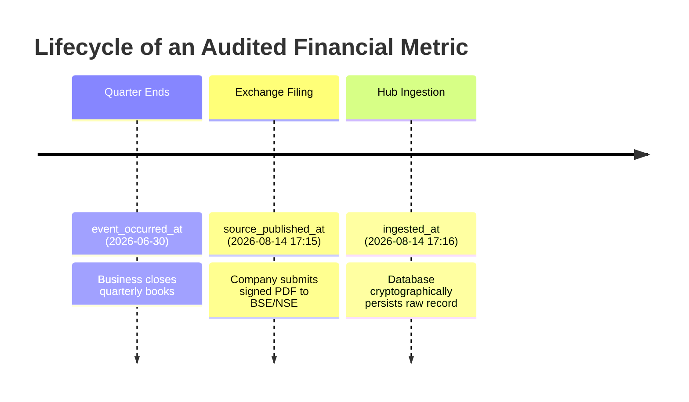
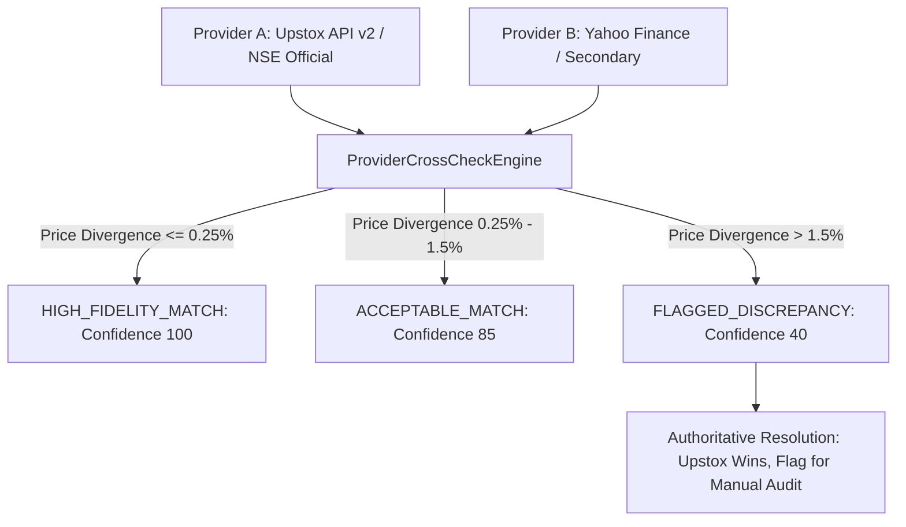

# Volume 01: Data Truth, Bitemporal Mechanics & Ingestion Architecture

> **Invariant:** A single false or unverified assumption in data engineering corrupts all downstream quantitative intelligence. The Stock Watchlist Hub is built on verifiable regulatory ground truth and absolute anti-lookahead quarantine.

---

## 1. The Triple-Timestamp Point-in-Time (PIT) Architecture

Most backtesting systems and equity platforms fail because they query past data with knowledge from the future. 
For example, treating a company's Q1 (April–June) earnings as if an investor knew them on June 30th is a catastrophic lookahead error—those earnings were not legally published to the stock exchange until August 14th.

To eliminate lookahead bias completely, every financial row in `src/db/models/bitemporal_financial.py` and every corporate announcement in `src/db/models/announcement.py` carries three distinct timestamps:



### The 3 Timestamps Defined:
1. **`event_occurred_at` (Economic Date):** The end of the reporting financial period (e.g. `2026-06-30`).
2. **`source_published_at` (Regulatory Release Date):** The exact timestamp when the filing was submitted to the exchange under SEBI LODR Clause 33.
3. **`ingested_at` (System Ingestion Date):** The system clock timestamp when the record entered the SQLite database.

### The As-Of Query Rule
When performing any historical simulation, backtest, or feature extraction as of date $T_{\text{eval}}$:
$$\text{Filter Condition: } \text{source\_published\_at} \le T_{\text{eval}}$$
Any filing published after $T_{\text{eval}}$ is invisible to the model, exactly as it was to market participants on that date.

---

## 2. The Fundamental Lookback Rule (SEBI LODR Compliance)

Under Indian securities regulation (SEBI LODR Regulations, 2015), listed companies are legally required to file full audited balance sheets only **twice per year**:
- **Annual Results:** As of March 31st (filed by May 30th).
- **Semi-Annual Results:** As of September 30th (filed by November 14th).

For intermediate quarters (Q1 June and Q3 December), companies publish **Limited Review Financial Statements**, which report Net Sales, Operating Profit, and Net Profit, but **omit** full balance sheets.

### How Other Tools Cheat:
Retail tools either interpolate balance sheet items arbitrarily or fabricate intermediate figures.

### How Our Engine Solves It ([`FeatureEngine`](file:///d:/Projects/Stock_Watchlist_Hub/src/analytics/feature_engine.py)):
For Q1 and Q3, the engine computes:
$$\text{TTM Operating Profit (EBIT)} = \sum_{i=0}^{3} \text{Quarterly EBIT}_{t-i}$$
$$\text{Capital Employed} = \text{Balance Sheet Capital Employed as of the most recent audited filing}$$
The system explicitly tags the calculation with `roce_methodology = "LAST_AUDITED_BS"`, ensuring mathematical defensibility without fabricating artificial numbers.

---

## 3. Regulatory Data Ingestion Pipeline

The platform uses a modular, resilient ingestion hierarchy:

```
┌────────────────────────────────────────────────────────────────────────┐
│                        DATA INGESTION HIERARCHY                        │
├─────────────────────────┬──────────────────────────────────────────────┤
│ Provider                │ Responsibilities                             │
├─────────────────────────┼──────────────────────────────────────────────┤
│ 1. Upstox API v2        │ Real-time LTP, 1-min & Daily OHLCV candles, │
│    (Primary Live Feed)  │ Level-2 Order Book Depth (5-bid / 5-ask),   │
│                         │ Exchange VWAP, Total Traded Volume           │
├─────────────────────────┼──────────────────────────────────────────────┤
│ 2. BSE Disclosures API  │ Instantaneous corporate announcements, Board │
│    (Regulatory Filings) │ meeting notices, Capex releases, signed PDF  │
│                         │ filing verification links                    │
├─────────────────────────┼──────────────────────────────────────────────┤
│ 3. Screener / TV Feed   │ 10-year audited IND-AS consolidated balance  │
│    (Fundamental Truth)  │ sheets, P&L, Cash Flow statements, and       │
│                         │ SEBI shareholding patterns                   │
├─────────────────────────┼──────────────────────────────────────────────┤
│ 4. NSE Indices Feed     │ India VIX, Nifty 50 P/E, Nifty 50 P/B,      │
│    (Macro Regime)       │ Combined with Brent Crude, USD/INR, 10Y G-Sec│
├─────────────────────────┼──────────────────────────────────────────────┤
│ 5. YFinance Client      │ Automated fallback provider if broker token  │
│    (Fail-Safe Backup)   │ is expired or during off-market batch sync   │
└─────────────────────────┴──────────────────────────────────────────────┘
```

### Shareholding Invariant Enforcement
SEBI mandates that shareholding patterns sum to 100%. The ingestion validator strictly enforces:
$$\text{Promoter \%} + \text{FII \%} + \text{DII \%} + \text{Public \%} + \text{Others \%} = 100.00 \pm 0.05\%$$
If the delta exceeds $0.05\%$ due to vendor truncation, the record is flagged for audit remediation rather than accepted blindly.

---

## 4. Corporate Actions & Non-Mutating Price Adjustments

A major vulnerability in financial databases is mutating raw historical prices when a stock splits or issues bonus shares. If raw rows are overwritten, historical auditability is lost.

### Our Solution ([`PriceAdjuster`](file:///d:/Projects/Stock_Watchlist_Hub/src/analytics/price_adjuster.py) & [`CorporateActionsManager`](file:///d:/Projects/Stock_Watchlist_Hub/src/ingestion/corporate_actions.py)):
1. **Raw Database Invariant:** Table `daily_price_raw` always stores the **genuine unadjusted historical price** as traded on that day.
2. **Adjustment Factor Table (`corporate_actions`):** Stores event date, corporate action type (`SPLIT`, `BONUS`, `DIVIDEND`), and cumulative adjustment ratio $C_{\text{factor}}$.
3. **Dynamic On-The-Fly Calculation:**
   $$\text{Adjusted Price}_t = \text{Raw Price}_t \times C_{\text{factor}}(t)$$
4. **Result:** Full reproducibility of historical trade executions while calculating correct splits, bonuses, and technical indicators (RSI, Moving Averages).

---

## 5. Audit Traces & Cryptographic Signatures

Every time an analysis dossier or snapshot is produced:
- The exact inputs are serialized into canonical JSON.
- A **SHA-256 cryptographic hash** is generated and stored in `data_audit_trace`.
- An operator can verify at any time whether a record was modified after generation.

---

## 6. Dual-Provider Cross-Check & Discrepancy Resolution Engine

To prevent vendor outages or corrupted feeds from polluting the analytical core, [`ProviderCrossCheckEngine`](file:///d:/Projects/Stock_Watchlist_Hub/src/ingestion/provider_crosscheck.py) implements automated multi-source reconciliation:



### Divergence Classification:
$$\text{Price Divergence \%} = \frac{|\text{Price}_A - \text{Price}_B|}{\text{Price}_A} \times 100$$

1. **`HIGH_FIDELITY_MATCH` (Divergence $\le 0.25\%$):** Absolute parity across vendors; maximum confidence score ($100$).
2. **`ACCEPTABLE_MATCH` ($0.25\% < \text{Divergence} \le 1.50\%$):** Minor closing-auction timestamp delta; confidence score ($85$).
3. **`FLAGGED_DISCREPANCY` (Divergence $> 1.50\%$):**
   - **Conflict Resolution Rule:** The authoritative primary source (Upstox / official NSE) **always wins**. The system never takes the mathematical maximum (which could choose a stale, unadjusted price).
   - Marked as `LOW_CONFIDENCE` and logged in `data_audit_trace` for operator review.

