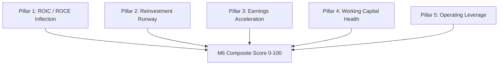

# Volume 02: The 5-Pillar Multibagger Model & M6 Scoring Engine

> **Thesis:** 10x multibaggers are not born from hype or speculation. They are the mathematical result of an economic engine deploying capital at high returns (ROIC) with a vast reinvestment runway, compounding operating earnings faster than the market's initial expectations.

---

## 1. The 5 Quantitative Pillars of Multibaggers

The platform evaluates structural compounders using 5 mathematically validated pillars:



### Pillar 1: ROIC & ROCE Inflection ($\Delta\text{EBIT} / \Delta\text{CE}$)
* **The Concept:** High current ROCE is good, but **inflection** (a sudden acceleration in returns on incremental capital) is what drives the sharpest valuation re-ratings.
* **The Formula:**
  $$\text{Incremental ROCE} = \frac{\text{EBIT}_{t} - \text{EBIT}_{t-1}}{\text{Capital Employed}_{t} - \text{Capital Employed}_{t-1}}$$
* **Thresholds:**
  - $> 25\%$ Incremental ROCE: **Elite Tier** (Inflection confirmed).
  - $15\% - 25\%$: **Healthy Compounder**.
  - $< 12\%$: **Capital Destructive** (Fails Pillar 1).

### Pillar 2: Capital Reinvestment Runway ($RR$)
* **The Concept:** A company generating $50\%$ ROCE that cannot reinvest its cash has nowhere to deploy profits, forcing it to pay dividends or buy back shares. A true multibagger must have both high return *and* high reinvestment capacity.
* **The Formula:**
  $$\text{Reinvestment Rate} = \frac{\text{Capex} + \Delta\text{Working Capital} - \text{Depreciation}}{\text{NOPAT}}$$
  $$\text{Intrinsic Growth Potential} = \text{Reinvestment Rate} \times \text{ROIC}$$
* **Thresholds:**
  - High Reinvestment ($> 60\%$) + High ROIC ($> 20\%$): **Maximum Compounding Velocity**.

### Pillar 3: Revenue & Operating Profit Acceleration
* **The Concept:** Linear growth is priced in; non-linear acceleration catches consensus off-guard.
* **Criteria:**
  - TTM Sales Growth $\ge 18\%$ YoY.
  - TTM Operating Profit Growth $\ge 25\%$ YoY (indicating profit growth outpaces revenue growth).
  - Consistent quarterly sequential improvement over at least 3 consecutive quarters.

### Pillar 4: Working Capital Sentinel & Cash Conversion Cycle (CCC)
* **The Concept:** Revenue growth that only exists on accounts receivable is an accounting red flag. A sound business turns sales into cold cash.
* **The Formula:**
  $$\text{CCC (Days)} = \text{DSO (Debtor Days)} + \text{DIO (Inventory Days)} - \text{DPO (Payable Days)}$$
* **The Forensic Test:**
  $$\text{Cumulative 3-Year CFO} \ge 0.80 \times \text{Cumulative 3-Year PAT}$$
  If Cash Flow from Operations (CFO) is consistently lower than Reported Net Profit (PAT), the company is penalized for aggressive revenue accrual.

### Pillar 5: Operating Leverage & Margin Expansion
* **The Concept:** Fixed costs remain steady while gross profits expand, causing operating margins (OPM) to surge.
* **Criteria:**
  $$\Delta\text{OPM (YoY)} \ge +150 \text{ bps}$$
  $$\frac{\% \Delta \text{EBIT}}{\% \Delta \text{Revenue}} > 1.20 \quad (\text{Degree of Operating Leverage})$$

---

## 2. Model M6 Long-Term Structural Score ($0-100$)

The **M6 Score** aggregates the 5 pillars, governance health, and institutional ownership into a single deterministic number:

| Weight | Factor | Scoring Logic |
| :---: | :--- | :--- |
| **25%** | **ROIC & ROCE Quality** | Full points for $ROCE \ge 22\%$ with positive incremental delta. |
| **25%** | **Reinvestment Velocity** | Full points for high reinvestment rate backed by healthy free cash flow. |
| **20%** | **Earnings Acceleration** | Evaluates 3-year CAGR and quarterly sequential earnings momentum. |
| **15%** | **Balance Sheet & Solvency** | Debt-to-Equity $< 0.50$, Interest Coverage Ratio $> 5.0\times$. |
| **15%** | **Governance & Float Quality** | Promoter stake stability, promoter pledge $\le 5\%$, rising FII/DII stake. |

### Score Classifications:
* **$80 - 100$ [ELITE COMPOUNDER]:** High conviction structural compounder. Sizing guideline: Core allocation ($5\% - 8\%$ portfolio weight).
* **$65 - 79$ [STRONG QUALITY]:** Sound business model with healthy runway. Suitable for multi-quarter accumulation.
* **$50 - 64$ [CYCLICAL / MODERATE]:** Quality dependent on sector tailwinds or raw material pricing cycles.
* **$< 50$ [SPECULATIVE / WEAK]:** Capital destructive or low moat. Unsuitable for long-term compounding.

---

## 3. The 9 Fundamental Multibagger Questions

Every stock in the watchlist is automatically subjected to the **9 Institutional Questions**:

1. **Q1 (2× Realization Runway):** Can this business double its operating cash flows within 36 months without diluting equity?
2. **Q2 (5× Tail Potential):** Is there an unpriced optionality (e.g. export expansion, PLI scheme beneficiary, new manufacturing line)?
3. **Q3 (10× TAM Scalability Limits):** What is the Total Addressable Market? Is market share currently below 10% in a rapidly expanding sector?
4. **Q4 (Corporate Lifecycle Stage):** Is the company in Stage 2 (Rapid Acceleration) or Stage 3 (Mature Dominance)? (Stage 2 provides the highest probability of multibagger outcomes).
5. **Q5 (Capital Reinvestment & Moat):** Does the company enjoy pricing power (Gross Margins $> 35\%$) and high barriers to entry?
6. **Q6 (Critical Invalidation Risks):** What can kill the thesis? (e.g., Raw material shock, key customer concentration $> 30\%$, regulatory pricing caps).
7. **Q7 (Market Mispricing & Expectation Gap):** Why does this opportunity exist? Is consensus underestimating earnings power due to temporary one-off capex drags?
8. **Q8 (Safe Liquidity Capacity):** What is the maximum safe position size (in ₹ Crores) before market impact exceeds 1.0% of average daily turnover?
9. **Q9 (Pre-Mortem Falsification Audit):** If this investment loses 40% over the next two years, what will have been the exact cause? (Forensic check).

---

## 4. Forensic Accounting Safeguards

Before any stock is assigned an M6 score, it must pass three automated forensic filters:
1. **Promoter Pledging Sentinel:** Any promoter pledge $> 10\%$ triggers an immediate $-15$ point score penalty. Any pledge $> 25\%$ disallows long-term conviction rating.
2. **Auditor Quality Check:** Detects auditor resignations or qualifications in annual financial notes.
3. **Institutional float expansion:** Measures whether FII + DII holdings have increased over the past two quarters ($\Delta \text{Inst} > 0$).

---

## 5. The 8-Stage Corporate Lifecycle Classifier

Located in [`src/analytics/lifecycle_classifier.py`](file:///d:/Projects/Stock_Watchlist_Hub/src/analytics/lifecycle_classifier.py), this engine powers **Question 4 (Early vs Late Stage Lifecycle)** of the 9 Multibagger Questions.

```
       1. EARLY_SMALL (Seed/Niche) ──> 2. SCALING (Capex Aggression)
                                                  │
                                                  ▼
     4. OPERATING LEVERAGE <── 3. RAPID EARNINGS EXPANSION (Margin Inflection)
             │
             ▼
     5. INSTITUTIONAL DISCOVERY ──> 6. RERATING (Multiple Expansion)
                                            │
                                            ▼
     8. DECLINING (Capital Destruction) <── 7. MATURE (Cash Cow / High Dividend)
```

### Deterministic Stage Rules:
* **Stage 1 (`1_EARLY_SMALL`):** Micro-cap ($\text{Market Cap} < ₹1,000 \text{ Cr}$), revenue $< ₹200 \text{ Cr}$. High uncertainty, wide variance.
* **Stage 2 (`2_SCALING`):** Aggressive top-line reinvestment ($\text{Sales Growth} \ge 25\%$, Capex/Revenue $> 15\%$).
* **Stage 3 (`3_RAPID_EARNINGS_EXPANSION`):** EBITDA margin expansion ($> 150 \text{ bps}$ YoY), EBITDA growth $> 30\%$.
* **Stage 4 (`4_OPERATING_LEVERAGE`):** Operating leverage peak: PAT growth $\ge 1.50\times$ revenue growth, with $ROCE \ge 20\%$. **(Prime Multibagger Sweet Spot)**.
* **Stage 5 (`5_INSTITUTIONAL_DISCOVERY`):** Institutional ownership crosses $15\%$ from below $5\%$; liquidity threshold unlocks DII/FII mutual fund mandates.
* **Stage 6 (`6_RERATING`):** Valuation multiple re-rating: P/E expands from sub-20x to 40x+ as market recognizes structural moat.
* **Stage 7 (`7_MATURE`):** Slow growth ($< 10\%$), high dividend payout ($> 35\%$), low reinvestment runway.
* **Stage 8 (`8_DECLINING`):** $\Delta\text{ROCE} < -500 \text{ bps}$, negative sales growth, capital destruction.

---

## 6. The Dual-Track Exponential Catalyst Decay Engine

Corporate announcements vary drastically in economic importance. A routine dividend filing has zero multi-year impact, whereas a massive factory commissioning shifts the earnings power for years.

[`AnnouncementDecayEngine`](file:///d:/Projects/Stock_Watchlist_Hub/src/analytics/announcement_decay_engine.py) models announcement relevance via **Dual-Track Exponential Half-Life Decay**:

$$\text{Decayed Score}(t) = \text{Base Materiality Score} \times \exp\left( - \frac{\ln(2)}{T_{1/2}} \times \Delta t \right)$$

```mermaid
graph LR
    ANN[Official Exchange Filing] --> TEXT[Regex Monetary Extractor]
    TEXT --> TRACK{Track Type}
    TRACK -->|Track A: Tactical Events| TACT[Half-Life: 48 Hours | Dissipates in 7 Days]
    TRACK -->|Track B: Structural Catalysts| STRUCT[Half-Life: 90 Days | Compounds over 2 Quarters]
```

### Dual Tracks:
1. **Track A (Tactical Events — Half-Life: 48 Hours):**
   - Includes earnings surprises, dividend declarations, bonus/splits, general board meetings.
   - Absorbed by market price within 5–7 trading sessions.
2. **Track B (Structural Catalysts — Half-Life: 90 Days / 2,160 Hours):**
   - Includes USFDA/regulatory clearances, large Capex commissioning, multi-year defence/infrastructure order wins.
   - Remains active across multiple quarters as physical revenue ramps up.

### Regex Monetary Value Extraction:
The engine parses raw BSE disclosure text using monetary regex patterns:
- Detects strings like `"awarded contract worth Rs. 1,450 Crores"` or `"Capex of ₹ 800 Cr"`.
- Calculates **Materiality Ratio**:
  $$\text{Materiality Ratio} = \frac{\text{Order / Capex Value (₹ Cr)}}{\text{TTM Revenue (₹ Cr)}}$$
- If an order win represents $> 30\%$ of annual revenue, the catalyst score is elevated to maximum structural conviction ($100/100$).

