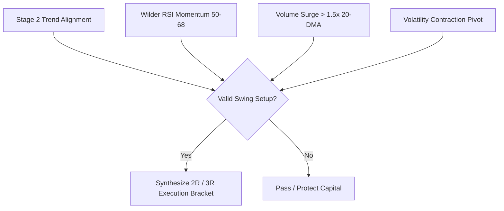

# Volume 03: Swing Trading Mechanics & Historical Replay Engine

> **Thesis:** Swing trading is not about predicting market noise. It is the systematic capture of 2-to-4 week momentum expansions where institutional accumulation pushes price out of consolidation bases, executed with asymmetric risk/reward brackets (minimum 1:2 RR).

---

## 1. The Core Swing Setup Rules

The swing engine identifies setups that meet four concurrent technical and volume criteria:



### 1. Stage 2 Trend Alignment
Price must demonstrate clear institutional trend sponsorship:
$$\text{Price} > \text{EMA}_{20} > \text{SMA}_{50} > \text{SMA}_{200}$$
$$\text{Slope}(\text{SMA}_{50}) > 0 \quad \text{over the past 20 trading sessions}$$

### 2. Wilder's Smoothed RSI Momentum (14-Period)
Unlike cut-rate standard RSI, the engine uses **J. Welles Wilder's original exponential smoothing**:
* **Ideal Entry Corridor:** $52 \le \text{Wilder RSI} \le 68$.
* **Interpretation:** The stock has clear bullish momentum but has **not yet become overbought** ($> 70$). Entries above 75 are strictly prohibited to prevent chasing extended moves.

### 3. Volume Ignition Confirmation
Breakout candle volume must confirm institutional participation:
$$\text{Daily Volume} \ge 1.50 \times \text{SMA}_{20}(\text{Volume})$$

### 4. Pivot Proximity & Base Contraction
Price must be breaking out of a tight base or testing a pullback to the rising 20-day EMA within $3.0\%$ of the pivot line.

---

## 2. Dynamic Asymmetric Brackets (1:2 and 1:3 RR)

Every swing setup is delivered with a mathematically fixed execution bracket:

```
                  ┌─────────────────────────────────────┐ Target 2 (3R Runner)
                  │ Potential Gain: +3R (+12% to +18%)  │
                  ├─────────────────────────────────────┤ Target 1 (2R Half-Off)
                  │ Potential Gain: +2R (+8% to +12%)   │
══════════════════╪═════════════════════════════════════╡ Entry Trigger Price
                  │ Max Risk Budget: -1R (-4% to -6%)   │
                  └─────────────────────────────────────┘ Guaranteed Stop Loss
```

### Risk/Reward Mechanics:
1. **Risk Unit ($R$):**
   $$R = \text{Entry Price} - \text{Stop Loss}$$
2. **Stop Loss (SL) Placement:**
   Placed mathematically below the recent swing pivot or $1.5 \times \text{ATR}_{14}$ below the entry price, anchored beneath the rising 20-day EMA.
3. **Target 1 ($T1 = \text{Entry} + 2R$):**
   When price hits $T1$, the operator books **50% of the position** and immediately trails the stop loss on the remaining 50% to **Breakeven (Entry Price)**.
4. **Target 2 ($T2 = \text{Entry} + 3R$):**
   The remaining 50% position runs toward $T2$ or trails with a 10-day EMA close.
5. **Enforced Invariant:**
   $$\text{Expected Reward} \ge 1.50 \times \text{Risk}$$
   Any setup with an RR ratio below $1.50$ is automatically discarded by the engine.

---

## 3. The Walk-Forward Historical Swing Replay Engine

To prove that the swing strategy generates positive mathematical expectancy without curve-fitting, the platform includes the **Walk-Forward Historical Replay Engine** ([`HistoricalSwingReplayEngine`](file:///d:/Projects/Stock_Watchlist_Hub/src/analytics/historical_swing_replay_engine.py)):

### Replay Engine Methodology:
1. **Day-by-Day Time Travel:** The engine iterates through historical trading days sequentially. On date $T$, it has zero knowledge of prices on date $T+1$.
2. **Strict Order Execution Realism:**
   - Orders cannot execute at the theoretical high or low of the day.
   - Entry orders execute at the **Open of date $T+1$** following an evening breakout signal.
   - Includes a realistic slippage model ($0.15\%$) plus statutory transaction costs (STT, exchange turnover fees, GST, stamp duty).
3. **Survivorship Bias Firewall:** Evaluates both past winners and historical companies that consolidated or failed, ensuring realistic win rates.

### Performance Analytics Produced:
* **Win Rate:** Percentage of trades reaching $T1$ or $T2$.
* **Profit Factor:** $\frac{\text{Gross Realized Profits}}{\text{Gross Realized Losses}}$.
* **Expectancy ($E$):**
  $$E = (\text{Win Rate} \times \text{Avg Win}) - (\text{Loss Rate} \times \text{Avg Loss})$$
* **Maximum Historical Drawdown:** Peak-to-trough equity decline across multi-year market corrections.
