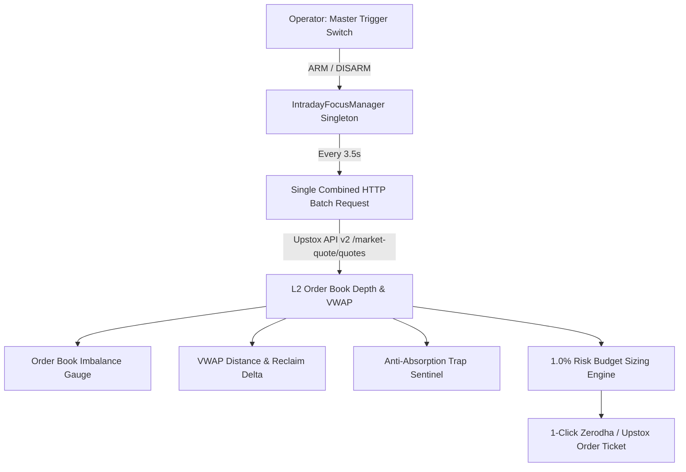

# Volume 04: On-Demand Intraday Focus Radar & Microstructure

> **Thesis:** Intraday outperformance is achieved by filtering out 98% of market noise, focusing on a tight basket of 3 to 8 high-conviction in-play equities, and using real-time Level 2 order book depth to front-run institutional liquidity while avoiding retail distribution traps.

---

## 1. Why Conventional Day Trading Setups Fail

Retail intraday traders consistently lose money because of three fundamental flaws:
1. **API & Cognitive Overload:** Attempting to monitor 50 to 100 live tickers simultaneously. The trader gets confused, reacts late, and exhausts broker API rate limits.
2. **Liquidity Absorption Traps:** Retail traders buy simple price breakouts when a stock hits a new Day's High. Institutional algorithms use this influx of retail buy orders as exit liquidity, dumping large block orders into the bids and triggering sharp reversals.
3. **Arbitrary Position Sizing:** Guessing round share quantities (e.g. 50 or 100 shares) regardless of stock volatility or distance to stop loss, risking 5% to 15% of account equity on a single bad scalp.

---

## 2. The On-Demand Intraday Architecture

To solve these flaws, the platform introduces the **On-Demand Intraday Focus Radar** ([`IntradayFocusManager`](file:///d:/Projects/Stock_Watchlist_Hub/src/analytics/intraday_focus_manager.py)):



### 1. The Master Arm/Disarm Switch
- **Default State (`[⚪ INTRADAY RADAR: OFF]`):** The background thread is completely dormant. It makes zero API calls, consumes zero network bandwidth, and uses zero CPU.
- **Armed State (`[🟢 RADAR ARMED (N)]`):** Initiates a focused 3.5-second micro-burst poller restricted exclusively to your chosen focus basket.
- **Market Hours Guard:** The engine automatically suspends polling outside 09:15–15:30 IST on trading days (Monday–Friday).

### 2. The Dynamic Focus Basket (3 to 8 Stocks Maximum)
- Stocks are added to the focus basket via the `🎯 +Focus` button found across the Watchlist, Screener, and Stock 360° modals.
- Capping the basket at 8 stocks prevents visual overload and keeps latency under **400ms per cycle**.
- All symbols are batched into a single comma-separated request (`instrument_key=NSE_EQ|...,NSE_EQ|...`), consuming less than 4% of the Upstox API rate ceiling.

---

## 3. Microstructure Analytics & The OBI Gauge

### 1. Level-2 Order Book Imbalance (OBI)
Standard charts only display completed trades (the past). The **OBI Gauge** examines the pending limit orders sitting in the Level-2 book (the immediate future).

$$\text{OBI Ratio} = \frac{\sum_{i=1}^{5} \text{Bid Quantity}_i}{\sum_{i=1}^{5} \text{Bid Quantity}_i + \sum_{i=1}^{5} \text{Ask Quantity}_i} \times 100$$

| OBI Ratio | Color / Visual | Market Microstructure Meaning |
| :---: | :---: | :--- |
| **$> 65\%$** | **Emerald Green** | **Aggressive Bid Stacking:** Institutional buyers are supporting price; high probability of immediate upward push. |
| **$45\% - 65\%$** | **Cyan / Neutral** | **Equilibrium:** Bids and asks are balanced; wait for directional imbalance. |
| **$< 40\%$** | **Rose Red** | **Heavy Ask Wall:** Institutional sellers are capping upside; high probability of sudden dump. |

---

## 4. The Anti-Absorption Trap Sentinel

The engine’s most valuable defensive feature is the **Absorption Trap Sentinel**:

```
PRICE ACTION: Stock breaks out to New Day's High (+3.2%)  ──> RETAIL BUYS
ORDER BOOK:   Total Bids: 12,000 | Total Asks: 85,000      ──> OBI = 12.3% (HEAVY SELL WALL)
SENTINEL:     ⚠️ WARNING: ABSORPTION TRAP (Smart money dumping into breakout liquidity)
DECISION:     STAND DOWN. DO NOT ENTER LONG.
```

### Trap Detection Invariant:
$$\text{Trigger Condition: } (\text{LTP} \ge 0.997 \times \text{Day High}) \quad \text{AND} \quad (\text{OBI} \le 40.0\%) \quad \text{AND} \quad (\text{LTP} \le \text{VWAP})$$
When triggered, the live card flashes an unmistakable amber/rose alert: **`⚠️ ABSORPTION TRAP`**, preventing the operator from buying the exact top of the daily candle.

---

## 5. Institutional VWAP Trajectory

Institutions execute large parent orders via algorithms benchmarked against **VWAP (Volume-Weighted Average Price)**:
* **$\Delta\text{VWAP} = \frac{\text{LTP} - \text{VWAP}}{\text{VWAP}} \times 100$**
* **Bullish Reclaim:** Price crosses from below VWAP to above VWAP accompanied by an $OBI > 60\%$.
* **Exhaustion Extension:** Price is $> 2.5\%$ above VWAP; risk of mean-reversion pullback is elevated.

---

## 6. Strict 1.0% Capital Risk Budgeting & 1-Click Tickets

Every intraday opportunity is automatically sized to protect your capital:

### Mathematical Position Sizing Formula:
$$\text{Account Equity} = ₹20,000 \quad (\text{Configurable})$$
$$\text{Max Risk Allowed (1.0\%)} = \text{Account Equity} \times 0.010 = ₹200.00$$
$$\text{Risk per Share} = \text{Entry Price} - \text{Stop Loss}$$
$$\text{Safe Quantity} = \left\lfloor \frac{\text{Max Risk Allowed}}{\text{Risk per Share}} \right\rfloor$$

### 1-Click Execution Modals:
Clicking **`⚡ MIS Ticket`** generates production-ready payloads for instant execution:

1. **Zerodha GTT / Bracket Order Syntax:**
   - Pre-calculated Trigger Price, Limit Price, Stop Loss, and Target with zero manual math.
2. **Upstox API MIS JSON Payload:**
   ```json
   {
     "quantity": 4,
     "product": "I",
     "validity": "DAY",
     "price": 4856.00,
     "tag": "RADAR_INTRADAY",
     "instrument_token": "NSE_EQ|INE066F01012",
     "order_type": "LIMIT",
     "transaction_type": "BUY",
     "disclosed_quantity": 0,
     "trigger_price": 0,
     "is_amo": false
   }
   ```
   Ready to copy or send directly via an automated webhook to execute in under 1 second.
