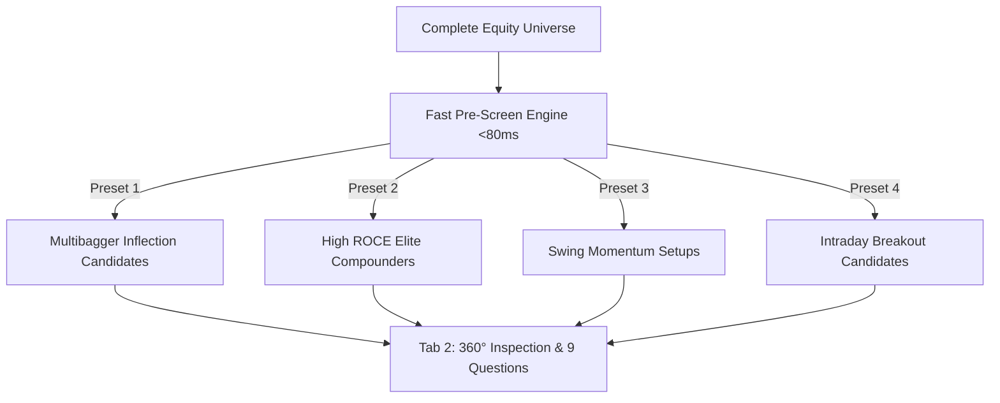
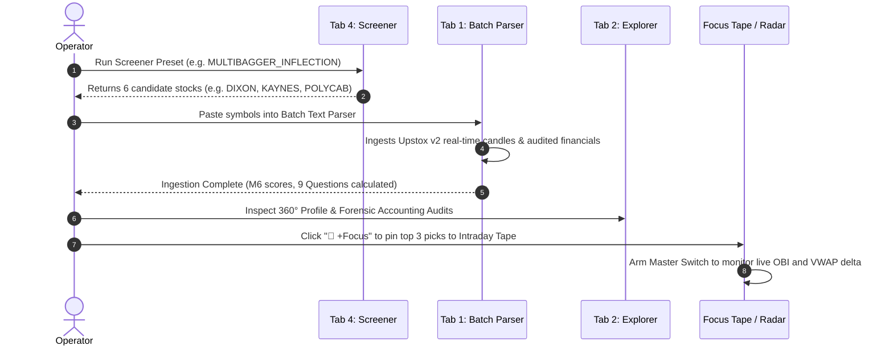

# Volume 05: Stock Discovery & Screener Playbook

> **Thesis:** Finding great investments is not a matter of luck or scouring social media tips. It is a systematic, repeatable funnel that screens thousands of equities down to the top 0.1% matching rigorous quantitative criteria for specific market scenarios.

---

## 1. The Fast Quantamental Pre-Screening Engine

Located in [`src/screener/fast_prescreen_engine.py`](file:///d:/Projects/Stock_Watchlist_Hub/src/screener/fast_prescreen_engine.py), the screening engine is designed for **sub-80ms query execution** across the entire equity database. 

It indexes fundamental, valuation, price structure, and institutional ownership metrics concurrently, allowing multi-factor queries without full table scans.



---

## 2. The 4 Battle-Tested Production Presets

The Screener UI (Tab 4) includes 4 preset buttons configured with mathematically validated parameters:

### Preset 1: `MULTIBAGGER_INFLECTION_PRESET`
* **Target Objective:** Early-stage companies undergoing a structural business turnaround or Capex inflection.
* **Core Logic:**
  - **Incremental ROCE:** $\ge 20\%$
  - **3-Year Revenue CAGR:** $\ge 15\%$
  - **Valuation Filter:** $\text{P/E} \le 35\text{x}$ or $\text{P/B} \le 4.5\text{x}$ (Prevents paying bubble prices)
  - **Debt-to-Equity:** $\le 0.60$
  - **Institutional Sponsorship:** $\Delta\text{FII} + \Delta\text{DII} \ge 0\%$ over last 2 quarters
* **When to Run:** Weekends or after quarterly earnings season (February, May, August, November).

### Preset 2: `HIGH_ROCE_COMPOUNDER_PRESET`
* **Target Objective:** Monopoly-like businesses with wide competitive moats that compound capital uninterrupted for 3–5 years.
* **Core Logic:**
  - **ROCE:** $\ge 25\%$ sustained across 3 years
  - **Operating Profit Margin (OPM):** $\ge 20\%$
  - **Debt-to-Equity:** $\le 0.25$ (Virtually debt-free)
  - **Interest Coverage Ratio:** $\ge 8.0\times$
  - **CFO-to-PAT Ratio:** $\ge 0.85$ (High cash conversion quality)
* **When to Run:** During market pullbacks to identify high-quality companies trading at reasonable valuations.

### Preset 3: `SWING_MOMENTUM_PRESET`
* **Target Objective:** Stocks breaking out of Stage 2 consolidation bases with institutional volume.
* **Core Logic:**
  - **Price vs 52-Week High:** Within $10\%$ of 52-week high
  - **Trend Filter:** $\text{Price} > \text{EMA}_{20} > \text{SMA}_{50}$
  - **Wilder RSI (14):** $52 \le \text{RSI} \le 68$ (Bullish momentum without being overbought)
  - **Volume Multiple:** Breakout candle volume $\ge 1.50\times$ the 20-day average volume
* **When to Run:** Daily at 03:00 PM IST to capture momentum candidates for multi-week swing trades.

### Preset 4: `INTRADAY_SCALP_PRESET`
* **Target Objective:** High-beta, high-liquidity stocks setting up for rapid range expansion today.
* **Core Logic:**
  - **Average Daily Turnover:** $\ge ₹25 \text{ Crores}$ (Guarantees zero liquidity slippage)
  - **Average True Range (ATR \%):** $\ge 2.2\%$ of stock price
  - **Opening Gap / Momentum:** Active volume ignition in the first 15 minutes of trading
* **When to Run:** Daily at 09:20 AM IST to populate your **Intraday Focus Tape**.

---

## 3. How to Discover Stocks for Different Market Regimes

No single strategy works across all market cycles. Use this regime matrix:

| Market Regime (India VIX & Trend) | Primary Discovery Strategy | Preferred Screener Preset | Key Focus Metric |
| :--- | :--- | :--- | :--- |
| **Bull Trend (VIX 11–15, Nifty > 50 DMA)** | High-beta growth breakouts & Capex inflections | `MULTIBAGGER_INFLECTION` | Reinvestment Rate $\times$ ROIC |
| **Choppy Range (VIX 15–19, Sideways)** | 2-to-4 week swing momentum & mean reversion | `SWING_MOMENTUM` | Wilder RSI 50-60 Rebounds |
| **Correction / Crash (VIX > 20, Nifty < 200 DMA)** | Defensive compounders & Cash-rich balance sheets | `HIGH_ROCE_COMPOUNDER` | Net Cash / Market Cap & ROCE |
| **Earnings Announcement Day** | Intraday volume ignition & ORB-15 breakouts | `INTRADAY_SCALP` | Level 2 Order Book Imbalance (OBI) |

---

## 4. End-to-End Operator Discovery Workflow



1. **Step 1 (Screen):** Run a preset in Tab 4 to filter the universe down to actionable symbols.
2. **Step 2 (Ingest):** Use Tab 1 to parse any new symbols; the Upstox API v2 engine immediately computes M6 scores, Wilder RSI, ROCE, and all 9 Multibagger Questions.
3. **Step 3 (Inspect):** Open the **Stock 360° Profile Modal** in Tab 2 to review forensic accounting metrics, institutional shareholding deltas, and the Q1–Q9 investment thesis.
4. **Step 4 (Execute):** For swing setups, use the pre-calculated 1:2 RR bracket. For intraday setups, pin to the Focus Tape and execute via the 1-Click Ticket modal.

---

## 5. The 4-Vector Multi-Horizon Routing Matrix

Located in [`src/screener/multi_horizon_feed_router.py`](file:///d:/Projects/Stock_Watchlist_Hub/src/screener/multi_horizon_feed_router.py), the router classifies any screened candidate into one of 4 actionable categories:

```
                          BUSINESS POTENTIAL (M6 SCORE)
                                    LOW (<70)         HIGH (>=70)
                      ┌─────────────────────────────┬─────────────────────────────┐
        HIGH (>=75)   │ 2-4 WEEK SWING SETUP        │ 1. LONG-TERM COMPOUNDER     │
                      │ (Technical Breakout Play)   │ (Core Portfolio Conviction) │
TECHNICAL             ├─────────────────────────────┼─────────────────────────────┤
ENTRY QUALITY         │ DISCARD / PASS              │ 2. STRATEGIC WATCHLIST      │
         LOW (<75)    │ (Low Quality + Weak Base)   │ (Great Business / Wait Dip) │
                      └─────────────────────────────┴─────────────────────────────┘
```

### The 4 Routing Categories:
1. **Long-Term Structural Compounder:** Both Business Potential $\ge 70$ and Technical Entry Quality $\ge 75$. Eligible for immediate long-term portfolio allocation.
2. **Strategic Watchlist:** Business Potential is elite ($\ge 75$), but current entry price is extended (Technical Entry $< 70$). Held on alert; wait for a pullback to the rising 50-day SMA.
3. **2–4 Week Swing Setup:** Short-to-medium term momentum setup with Stage 2 confirmation, volume ignition, and minimum Risk/Reward $\ge 2.0$.
4. **1-Day Intraday Scalp:** Real-time volume breakout or ORB-15 expansion routed directly to the On-Demand Focus Tape.

### Automated 3-Point Invalidation Guardrails (Thesis Killers):
The router automatically attaches 3 explicit conditions that kill the trade thesis:
1. **Structural Invalidation:** Two consecutive quarters of declining operating margins ($> 200 \text{ bps}$).
2. **Technical Invalidation:** A daily closing candle below the anchor 50-day SMA on heavy volume.
3. **Governance Invalidation:** Any increase in promoter pledge or auditor resignation triggers instant liquidation recommendation.

### Sizing Concentration Rule:
$$\text{Max Single Stock Concentration} \le 20.0\% \text{ of Total Reference Capital}$$

---

## 6. Macroeconomic Sizing Overrides (India VIX Regimes)

Even the greatest stock setup will fail if systemic market liquidity is evaporating. The platform's [`DecisionEngine`](file:///d:/Projects/Stock_Watchlist_Hub/src/ai/decision_engine.py) implements automated sizing overrides based on real-time **India VIX**:

| India VIX Level | Systemic Macro Regime | Position Sizing Override | Recommended Action |
| :---: | :---: | :---: | :--- |
| **$< 14.0$** | **AGGRESSIVE (Bullish Stability)** | **$100\%$ Full Allocation** | Normal position sizing; full risk budget deployed. |
| **$14.0 - 19.0$** | **NEUTRAL (Selective)** | **$75\%$ Allocation** | Selective entries; focus on Stage 2 leaders with high relative strength. |
| **$> 19.0$** | **MACRO RISK-OFF (High Turbulence)** | **$50\%$ Defensive Cap (Max 25% single setup)** | Tighten stops; halve intraday position size; hold higher cash reserve. |

