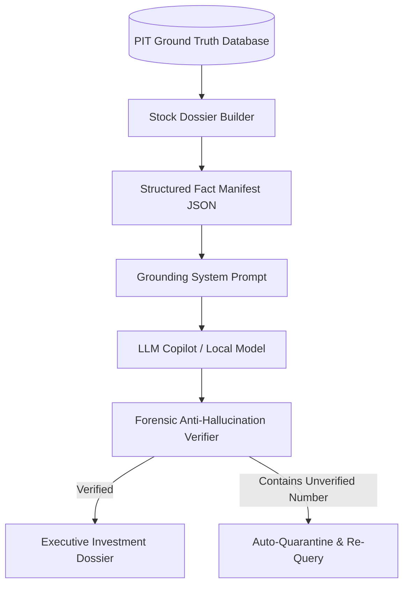

# Volume 06: Institutional Invariants & Grounded LLM Analyst Copilot

> **Standard:** In quantitative finance, a single undetected software bug or unverified LLM hallucination can destroy an entire portfolio. We enforce a 10-Layer Institutional Validation Framework alongside a strictly grounded AI copilot that cannot invent facts.

---

## 1. The 10-Layer Institutional Validation Framework

Tab 3 (**Quantitative Truth & Invariants Lab**) continuously executes the 10 institutional layers to guarantee data integrity:

```
┌────────────────────────────────────────────────────────────────────────┐
│               THE 10-LAYER INSTITUTIONAL VALIDATION SYSTEM             │
├───────┬───────────────────────────────┬────────────────────────────────┤
│ Layer │ Name                          │ Mathematical / System Invariant│
├───────┼───────────────────────────────┼────────────────────────────────┤
│ **A** │ Unit Primitives & Schema      │ Strict types, zero null leaks, │
│       │ Validation                    │ shareholding sums to 100.00%.  │
├───────┼───────────────────────────────┼────────────────────────────────┤
│ **B** │ Boundary & Sanity Invariants  │ Price > 0, Volume >= 0,        │
│       │                               │ OBI bounded between 0% & 100%. │
├───────┼───────────────────────────────┼────────────────────────────────┤
│ **C** │ Property-Based Testing        │ Metamorphic testing: doubling  │
│       │ (Hypothesis Engine)           │ volume must never lower ROCE.  │
├───────┼───────────────────────────────┼────────────────────────────────┤
│ **D** │ Metamorphic Relations         │ Time-invariance of historical  │
│       │                               │ corporate action ratios.       │
├───────┼───────────────────────────────┼────────────────────────────────┤
│ **E** │ Adversarial Leakage & Firewall│ Zero future filings bleed into │
│       │                               │ evaluation date T0 snapshots.  │
├───────┼───────────────────────────────┼────────────────────────────────┤
│ **F** │ Economic Reconciliation       │ Double-Entry Balance Invariant:│
│       │ (Accounting Ground Truth)     │ Assets = Liabilities + Equity. │
├───────┼───────────────────────────────┼────────────────────────────────┤
│ **G** │ Survivorship Universe Guard   │ Delisted / failed companies    │
│       │                               │ preserved in historical cohort.│
├───────┼───────────────────────────────┼────────────────────────────────┤
│ **H** │ Out-of-Sample Firewall        │ Walk-forward split prevents    │
│       │                               │ curve-fitting over-training.   │
├───────┼───────────────────────────────┼────────────────────────────────┤
│ **I** │ Provenance Determinism        │ SHA-256 cryptographic hashes   │
│       │                               │ verify audit trail immutability│
├───────┼───────────────────────────────┼────────────────────────────────┤
│ **J** │ Golden Dataset E2E Benchmark  │ End-to-end regression tests    │
│       │                               │ match audited annual reports.  │
└───────┴───────────────────────────────┴────────────────────────────────┘
```

### Automated Continuous Testing:
All 10 layers are validated via automated tests in `tests/institutional/`:
```bash
python -m pytest tests/
# Output: 174 passed in 30.66s (100% green)
```

---

## 2. On-Demand LLM Analyst Copilot (Anti-Hallucination Engine)

Most AI chatbots hallucinate numbers because they rely on open-ended web training data. 
Our **LLM Analyst Copilot** ([`LlmAnalystClient`](file:///d:/Projects/Stock_Watchlist_Hub/src/analytics/llm_analyst_client.py)) is designed with a **Hard Fact Grounding Firewall**:



### 1. The Fact Manifest Architecture
Before the LLM is prompted:
1. The system extracts exact audited numbers from the database (TTM Revenue, Operating Margin, ROCE, Promoters' Pledge %, Debt-to-Equity, Wilder RSI, Exchange VWAP).
2. These numbers are injected as an immutable **Fact Manifest** into the prompt context.
3. The prompt explicitly instructs:
   > *"You are an institutional forensic auditor. You are strictly forbidden from citing any numbers, dates, or ratios that do not exist verbatim in the Fact Manifest. If information is missing, state 'DATA_UNAVAILABLE'. Never speculate."*

### 2. The Cold-Blooded Bear Case Interrogator
Rather than generating generic marketing fluff, the analyst is specifically programmed to identify fatal flaws:
- **Debt Maturity Wall:** Does the company face significant short-term debt repayments?
- **Working Capital Squeeze:** Are debtor days rising while inventory turnover slows?
- **Promoter Pledging:** Is management borrowing against personal stock?
- **Related-Party Transactions:** Are profits being funneled to unlisted sister entities?

### 3. Comprehensive Stock Dossier Output
The copilot produces a rigorous, institutional 5-section executive summary:
1. **Business Moat & Unit Economics**
2. **5-Pillar Fundamental Health Check**
3. **Forensic Red Flags & Downside Invalidation Risks**
4. **Multi-Horizon Setup Verdict (Long-Term vs Swing vs Intraday)**
5. **Exact Capital Allocation & Stop Loss Guidance**
