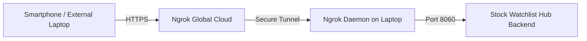

# Volume 07: Operations, Hosting, Scripts & Maintenance

> **Standard:** A research engine is only as good as its reliability. This volume details how to launch, operate, remotely tunnel, and maintain the Stock Watchlist & Information Hub with 1-click simplicity.

---

## 1. 1-Click Windows Operations Scripts

The root directory contains three automated Windows scripts that handle process management, networking, and daemon lifecycle without requiring manual terminal commands:

| Script | Purpose | How to Use |
| :--- | :--- | :--- |
| **`start_hub.bat`** | **1-Click Launch:** Spawns the Hub server (port 8060) and Ngrok remote tunnel in clean, minimized background windows. Displays the public URL and automatically opens your browser. | Double-click `start_hub.bat` |
| **`stop_hub.bat`** | **1-Click Shutdown:** Gracefully stops the Python backend server, cleans up background worker threads, and terminates the Ngrok tunnel process. | Double-click `stop_hub.bat` |
| **`manage_hub.bat`** | **Interactive Control Panel:** Provides an interactive menu to view live status, retrieve your current Ngrok URL, open the dashboard, restart services, or shut down. | Double-click `manage_hub.bat` |

### Underlying Architecture (`scripts/start_hub.ps1`):
The batch files delegate execution to clean PowerShell scripts (`scripts/start_hub.ps1`, `scripts/stop_hub.ps1`, `scripts/show_tunnel_url.ps1`). This avoids cmd.exe character escaping bugs and ensures:
- `--log=stdout` is passed to Ngrok so it runs persistently as a non-interactive daemon without stdin closure errors.
- Dynamic port detection checks if port 8060 is already active to prevent port collision conflicts.

---

## 2. Remote Access & Ngrok Tunneling

You can securely access your Hub from your smartphone, tablet, or external laptop from anywhere in the world:



### How to Retrieve Your Public URL:
1. Double-click `manage_hub.bat` and select Option 1 (**View Current Ngrok Tunnel URL**).
2. Or query the local Ngrok API directly in PowerShell:
   ```powershell
   (Invoke-RestMethod -Uri "http://localhost:4040/api/tunnels").tunnels[0].public_url
   ```
3. Your custom or dynamic tunnel will appear (e.g. `https://overhumane-gary-stainably.ngrok-free.dev`). 
4. Bookmark this URL on your phone for full on-the-go access to your Watchlist, Live Focus Tape, and 1-Click Order Tickets.

---

## 3. Upstox API v2 OAuth Authentication

The platform communicates directly with Upstox API v2 for Level-2 order book depth, OHLCV candles, and real-time market quotes.

### Initial Configuration (`.env`):
Ensure your `.env` file in the project root contains your developer credentials from the Upstox Developer Console:
```env
UPSTOX_API_KEY="your_api_key_here"
UPSTOX_API_SECRET="your_api_secret_here"
UPSTOX_REDIRECT_URI="http://localhost:8060/api/upstox/callback"
```

### Daily 1-Click Login Flow:
Under SEBI guidelines, broker API access tokens expire every 24 hours.
1. In the dashboard header, click the purple badge: **`🔐 UPSTOX: CONNECT`**.
2. A modal will open. Click **"🚀 Connect Upstox v2 API"**.
3. You will be redirected to the official Upstox login page. Enter your mobile number, OTP, and 6-digit PIN.
4. Upstox automatically redirects back to `http://localhost:8060/api/upstox/callback`.
5. The token is securely saved in `config/upstox_token.json`. The header badge updates immediately to **`🔐 UPSTOX: CONNECTED (Active)`**.

---

## 4. The Clickable Auto-Sync Toggle

In the top right of the dashboard header, the **Auto-Sync Toggle** controls the 5-minute background watchlist refresh:

* **Active State (`[🔄 AUTO-SYNC: ON (05:00)]`):** 
  - Emerald green badge. The timer counts down each second toward `00:00`.
  - Upon reaching zero, it silently queries the latest market quotes and financials, refreshing the KPI bar and watchlist table.
* **Paused State (`[⚪ AUTO-SYNC: PAUSED]`):** 
  - Single-click the button to pause. The timer freezes on `PAUSED`.
  - Backend worker immediately yields CPU and halts all background Upstox queries.
* **Resume:** Single-click the button again to resume the countdown.

### API Control Endpoints:
- `GET /api/watchlist/auto-sync/status`: Returns `{ "enabled": true/false, "interval_seconds": 300 }`.
- `POST /api/watchlist/auto-sync/toggle`: Receives `{ "enabled": true/false }` to programmatically toggle state.

---

## 5. Database Health, Backups & Troubleshooting

### Database Storage:
- The system stores all data in SQLite at `multibagger.db` using WAL mode (Write-Ahead Logging) for high concurrency:
  - `multibagger.db`: Main database table storage.
  - `multibagger.db-wal`: Write-ahead transaction log.
  - `multibagger.db-shm`: Shared memory index.
- **Backup:** To back up your data, simply copy `multibagger.db` to a separate storage drive while the server is stopped.

### Running Automated Test Suite:
Whenever making code modifications, run the institutional test suite:
```bash
python -m pytest tests/
```
Ensure all **174 tests pass** with zero failures.

### Troubleshooting Common Issues:

1. **Port 8060 Already in Use:**
   - Run `stop_hub.bat` to terminate any hanging python processes.
   - Or run in PowerShell:
     ```powershell
     Get-NetTCPConnection -LocalPort 8060 -ErrorAction SilentlyContinue | ForEach-Object { Stop-Process -Id $_.OwningProcess -Force }
     ```

2. **Upstox API Token Expired:**
   - If the badge shows `🔐 UPSTOX: EXPIRED` or `DISCONNECTED`, simply click the badge and complete the 30-second login flow.

3. **Ngrok Tunnel Not Starting:**
   - Check if you have an active Ngrok authtoken configured:
     ```bash
     ngrok config add-authtoken <YOUR_TOKEN>
     ```
   - Ensure you ran `start_hub.bat` which launches Ngrok with `--log=stdout`.
