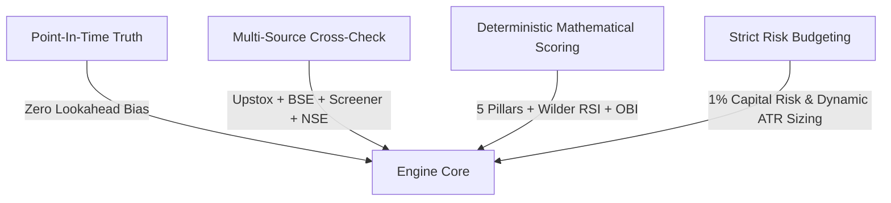

# 🏛️ Stock Watchlist & Information Hub — Master Operator's Handbook

Welcome to the definitive architectural manual and operating handbook for the **Stock Watchlist & Information Hub**. 

This platform is a quantitative and fundamental equity intelligence engine designed for institutional rigor, zero lookahead bias, and verifiable regulatory ground truth in Indian equity markets (NSE/BSE).

---

## 🧭 Documentation Navigation Map

This manual is divided into 8 focused, comprehensive volumes:

| Volume | Document | Description |
| :--- | :--- | :--- |
| **01** | [**Data Truth & Architecture**](file:///d:/Projects/Stock_Watchlist_Hub/Documentation/01_DATA_TRUTH_AND_ARCHITECTURE.md) | Triple-timestamp Point-in-Time (PIT) mechanics, anti-lookahead quarantine, regulatory lineage, and `ProviderCrossCheckEngine` multi-source reconciliation. |
| **02** | [**5-Pillar Multibagger & M6 Model**](file:///d:/Projects/Stock_Watchlist_Hub/Documentation/02_5PILLAR_MULTIBAGGER_AND_M6_MODEL.md) | ROIC inflection models, reinvestment runway, M6 scoring ($0-100$), the 9 Questions, 8-stage `LifecycleClassifier`, and `AnnouncementDecayEngine`. |
| **03** | [**Swing Trading & Replay Engine**](file:///d:/Projects/Stock_Watchlist_Hub/Documentation/03_SWING_TRADING_AND_REPLAY_ENGINE.md) | Wilder RSI momentum, Stage 2 trend breakouts, dynamic ATR multi-target brackets (2R/3R), and walk-forward historical simulation. |
| **04** | [**Intraday Focus Radar & Microstructure**](file:///d:/Projects/Stock_Watchlist_Hub/Documentation/04_INTRADAY_FOCUS_RADAR_AND_MICROSTRUCTURE.md) | Master trigger switch, Level-2 Order Book Imbalance (OBI), Anti-Absorption Trap Sentinel, and 1-click broker order tickets. |
| **05** | [**Stock Discovery & Screener Playbook**](file:///d:/Projects/Stock_Watchlist_Hub/Documentation/05_STOCK_DISCOVERY_AND_SCREENER_PLAYBOOK.md) | Sub-80ms quantamental prescreener, the 4 market-regime presets, `MultiHorizonFeedRouter` 4-vector matrix, and India VIX macro sizing overrides. |
| **06** | [**Institutional Invariants & LLM Analyst**](file:///d:/Projects/Stock_Watchlist_Hub/Documentation/06_INSTITUTIONAL_INVARIANTS_AND_LLM_ANALYST.md) | The 10-layer institutional validation framework (Layers A–J) and anti-hallucinating LLM Analyst Copilot. |
| **07** | [**Operations, Hosting & Maintenance**](file:///d:/Projects/Stock_Watchlist_Hub/Documentation/07_OPERATIONS_HOSTING_AND_MAINTENANCE.md) | 1-click Windows scripts (`start_hub.bat`, `stop_hub.bat`), Ngrok remote tunneling, Upstox OAuth flow, and troubleshooting. |
| **08** | [**Adaptive Market Strategy Matrix & Continuation Radar**](file:///d:/Projects/Stock_Watchlist_Hub/Documentation/08_ADAPTIVE_MARKET_MATRIX_AND_CONTINUATION_RADAR.md) | Top-down CMMI market mood index, dynamic TradingView filter synthesis, official NSE delivery bhavcopy ingestion, CLV/FSAR/Elasticity quant engine, Upper Circuit freeze sentinel, and 9:15 AM ORB-15 execution playbooks. |

---

## 💡 The Core Philosophy: Truth vs. Retail Noise

Conventional retail tools fail because they are built on three flawed assumptions:
1. **Static, Time-Agnostic Financials:** Calculating P/E or ROCE by dividing today's price by numbers that were not legally available on that date (severe lookahead bias).
2. **Survivorship Bias:** Only evaluating stocks that are currently winning, ignoring the thousands that went bankrupt or were delisted.
3. **Black-Box Sizing & Liquidity Blindness:** Suggesting trade setups without checking if the order book has sufficient depth or if the setup is actually an institutional distribution trap.

### The 4 Cornerstones of This Platform:

1. **Point-In-Time (PIT) Truth:** Every financial statement, corporate announcement, and shareholding pattern is stamped with both when the event occurred and when it was officially filed with the stock exchange. Backtests never "peek" into the future.
2. **Multi-Horizon Synthesis:** A single stock is analyzed across three distinct timeframes:
   - **Long-Term Compounder (1–3 Years):** Driven by ROIC expansion and reinvestment runway.
   - **Swing Momentum (2–4 Weeks):** Driven by Wilder RSI expansion and Stage 2 base breakouts.
   - **Intraday Scalp (1 Day):** Driven by Level 2 Order Book Imbalance (OBI) and VWAP reclaim.
3. **Anti-Absorption Sentinel:** Identifies when heavy ask walls are being dumped into retail breakout buyers at daily highs.
4. **Hard Mathematical Invariants:** 174 automated institutional tests continuously verify that no corporate actions break price continuity and no balance sheet reconciliations violate double-entry accounting.

---

## 🚀 Quick Start for Operators

### 1. Launching the System
Double-click `start_hub.bat` in the project root. This initializes:
- Local server at `http://localhost:8060`
- Background 5-minute continuous watchlist updater
- Public secure Ngrok tunnel for remote/mobile access

### 2. Daily Routine
1. **09:00 AM (Pre-Market):** Check **Market Session Badge** (`🔴 NSE: CLOSED` $\rightarrow$ `🟢 NSE: OPEN`).
2. **09:15 AM (Market Open):** Open **Tab 4 (Screener)** and run the `INTRADAY_SCALP_PRESET` or `SWING_MOMENTUM_PRESET`.
3. **09:30 AM (Focus Pinning):** Pin 3 to 5 candidate stocks to the **On-Demand Focus Tape** using the `🎯 +Focus` button.
4. **Active Trading:** Arm the **Master Radar Switch** (`[🟢 RADAR ARMED]`) to stream live 3.5s micro-burst feeds with OBI depth and VWAP delta.
5. **Execution:** Click `⚡ MIS Ticket` or `🎯 GTT Ticket` to copy mathematically sized orders directly into Zerodha or Upstox.
6. **Post-Market:** Review Tab 3 (Quantitative Truth Lab) to ensure all financial updates and invariant tests remain 100% verified.
