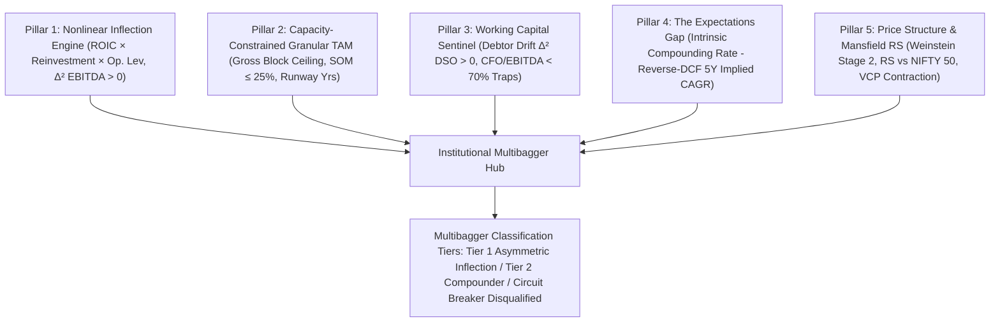

# Institutional Stock Analysis Thesis & Architectural Blueprint
**Platform:** Stock Watchlist Hub & Multibagger Discovery Engine  
**Standard:** Institutional Research-Grade / Zero Lookahead Bias / Verifiable Regulatory Ground Truth  

---

## Executive Summary

The platform is designed to identify compounders and potential multibaggers early, understand the fundamental drivers of outperformance, and systematically learn from false positives. 

Unlike conventional screeners that rely on surface-level static indicators or aggregated news blogs, this architecture functions as a **Point-in-Time (PIT), time-travelable company history and decision engine**. It connects every quantitative indicator back to audited regulatory filings, tracks the full lifecycle of a business, evaluates multi-horizon trading opportunities, and enforces strict risk management through macroeconomic overrides.

```
┌────────────────────────────────────────────────────────────────────────────────────────┐
│                      8-LAYER STOCK ANALYSIS & DISCOVERY ARCHITECTURE                   │
└────────────────────────────────────────────────────────────────────────────────────────┘
                                            │
  ┌─────────────────────────────────────────┼─────────────────────────────────────────┐
  ▼                                         ▼                                         ▼
[ LAYER 1: DATA TRUTH & LINEAGE ]   [ LAYER 2: POINT-IN-TIME (PIT) ENGINE ]   [ LAYER 3: BUSINESS ECONOMICS ]
• Audited IND-AS Fundamentals       • Triple-Timestamp Provenance             • Rolling TTM ROCE & Margins
• SEBI LODR Clause 31 Shareholding  • Lookahead Bias Quarantine               • Incremental ROCE (ΔEBIT/ΔCE)
• Signed Exchange Disclosures (PDF) • Exponential Catalyst Decay              • Reinvestment Compounding Rate
• Macro Indices & Commodities       • Data Relevance Daemon                   • CFO/PAT Accrual Quality
  │                                         │                                         │
  └─────────────────────────────────────────┼─────────────────────────────────────────┘
                                            ▼
  ┌───────────────────────────────────────────────────────────────────────────────────┐
  │ [ LAYER 4: QUALITATIVE LIFECYCLE & GOVERNANCE SCREENING ]                         │
  │ • 5-Stage Corporate Lifecycle Classification                                      │
  │ • Promoter Pledging, Institutional Deltas (ΔFII + ΔDII), Retail Float Expansion   │
  └───────────────────────────────────────────────────────────────────────────────────┘
                                            │
                                            ▼
  ┌───────────────────────────────────────────────────────────────────────────────────┐
  │ [ LAYER 5: THE 9 FUNDAMENTAL MULTIBAGGER DISCOVERY QUESTIONS ]                    │
  │ Q1: 2× Realization Runway           Q4: Early vs Late Stage     Q7: Market Pricing│
  │ Q2: 5× Tail Potential               Q5: Compounding Engine      Q8: Safe Capacity │
  │ Q3: 10× TAM Scalability Limits      Q6: Invalidation Risks      Q9: Falsification │
  └───────────────────────────────────────────────────────────────────────────────────┘
                                            │
                                            ▼
  ┌───────────────────────────────────────────────────────────────────────────────────┐
  │ [ LAYER 6: MULTI-HORIZON SETUP SYNTHESIS ]                                        │
  │ • Model M6 Long-Term Structural Compounder Score (0–100)                          │
  │ • 2–4 Week Swing Setup (Breakout / Trend Momentum with 1:1.5+ RR Parity)          │
  │ • 1-Day Intraday Scalp Setup (ATR Volatility & Range Expansion)                   │
  └───────────────────────────────────────────────────────────────────────────────────┘
                                            │
                                            ▼
  ┌───────────────────────────────────────────────────────────────────────────────────┐
  │ [ LAYER 7: MACRO REGIME & SYSTEMIC CAPITAL ALLOCATION OVERRIDE ]                  │
  │ • India VIX + Brent Crude + USD/INR + 10Y Sovereign Bond Yield Synthesis          │
  │ • Automated Defensive Sizing Override (e.g. 25% Allocation during Macro Risk-Off) │
  └───────────────────────────────────────────────────────────────────────────────────┘
                                            │
                                            ▼
  ┌───────────────────────────────────────────────────────────────────────────────────┐
  │ [ LAYER 8: IMMUTABLE T0 SNAPSHOTS & OUTCOME POST-MORTEM ENGINE ]                  │
  │ • Cryptographic SHA-256 Decision Snapshot at T0 Entry                             │
  │ • Daily Outcome Milestone Path Tracking (2× / 5× / 10× Realization)               │
  │ • Multi-Factor Post-Mortem Diagnostic on High-Conviction False Positives          │
  └───────────────────────────────────────────────────────────────────────────────────┘
```

---

## Detailed Architectural Breakdown

### Layer 1: Data Truth, Lineage & Regulatory Hierarchy

The system operates on an absolute **Zero-Fabrication Invariant**: missing data is marked `None` / `UNAVAILABLE` and never interpolated with arbitrary multipliers.

1. **Fundamental Financials ([ScreenerClient](file:///d:/Projects/Stock_Watchlist_Hub/src/ingestion/screener_client.py)):**
   * Sourced directly from audited IND-AS consolidated financial statements and 10-year balance sheet histories.
   * Extracts exact quarterly SEBI shareholding patterns with mathematical summation enforcement:
     $$\text{Promoter \%} + \text{FII \%} + \text{DII \%} + \text{Public \%} + \text{Govt \%} = 100.00\%$$
2. **Corporate Disclosures ([BseAnnouncementsClient](file:///d:/Projects/Stock_Watchlist_Hub/src/ingestion/bse_announcements_client.py)):**
   * Direct connection to BSE Disclosures JSON API (`api.bseindia.com`) and NSE Corporate Announcements feed.
   * Links directly to signed official PDF filings (`https://www.bseindia.com/xml-data/corpfiling/AttachLive/...`).
3. **Market Price Data ([UpstoxMarketDataIngestion](file:///d:/Projects/Stock_Watchlist_Hub/src/ingestion/upstox_client.py) & [YFinanceClient](file:///d:/Projects/Stock_Watchlist_Hub/src/ingestion/yfinance_client.py)):**
   * Real-time LTP and daily OHLCV candles with split/bonus adjustments.
   * Dynamic daily incremental sync ensures the database is automatically up-to-date with the latest trading session.
4. **Macroeconomic Feeds ([MacroRegimeClient](file:///d:/Projects/Stock_Watchlist_Hub/src/ingestion/macro_client.py)):**
   * Direct connection to NSE `/api/allIndices` for real-time India VIX, Nifty 50 P/E, and Nifty 50 P/B, combined with global benchmark commodities (Brent Crude Oil, USD/INR, 10Y Indian Government Bond Yield).

---

### Layer 2: Point-in-Time (PIT) Truth & Anti-Lookahead Defense

To prevent lookahead bias in backtests and historical cohort research, every data point carries a **Triple-Timestamp Provenance**:

1. **`event_occurred_at`:** The historical period end date (e.g., Q1 June 30, 2026).
2. **`source_published_at`:** The official filing release timestamp to the stock exchange (e.g., August 14, 2026 17:15:00).
3. **`ingested_at`:** The exact system ingestion timestamp.

#### The Fundamental Lookback Rule (SEBI LODR Compliance)
Indian listed companies file full balance sheets only for Annual (March 31) and Semi-Annual (Sept 30) periods. For intermediate quarters (Q1 June / Q3 December Limited Reviews), [FeatureEngine](file:///d:/Projects/Stock_Watchlist_Hub/src/analytics/feature_engine.py) performs a lookback to the most recent audited balance sheet, flagging `roce_methodology="LAST_AUDITED_BS"` without fabricating intermediate numbers.

#### The Exponential Catalyst Decay Engine ([AnnouncementDecayEngine](file:///d:/Projects/Stock_Watchlist_Hub/src/analytics/announcement_decay_engine.py))
Corporate announcements are treated like physical events with exponential half-life decay:
$$\text{Decayed Score}(t) = \text{Raw Score} \times \left(\frac{1}{2}\right)^{\frac{\Delta t}{T_{1/2}}}$$
* **Tactical Track ($T_{1/2} = 48\text{ hours}$):** Order wins, board meetings, broker con-calls decay rapidly and transition to `ABSORBED_INTO_PRICE`.
* **Structural Track ($T_{1/2} = 90\text{ days}$):** Mergers, Capex expansion, promoter stake increases remain active until absorbed into audited financial statements (`ABSORBED_INTO_FINANCIALS`).

---

### Layer 3: Quantitative Fundamental Feature Engineering

The fundamental engine focuses on economic value creation rather than accounting cosmetic profit:

1. **Return on Capital Employed (ROCE):**
   $$\text{ROCE} = \frac{\text{TTM EBIT}}{\text{Period-Average Capital Employed}} = \frac{\text{TTM Operating Profit}}{\text{Average}(\text{Net Worth} + \text{Total Borrowings})}$$
2. **Incremental Return on Capital Employed ([ReinvestmentCalculator](file:///d:/Projects/Stock_Watchlist_Hub/src/analytics/reinvestment_calculator.py)):**
   $$\text{Incremental ROCE} = \frac{\text{EBIT}_{t} - \text{EBIT}_{t-n}}{\text{Capital Employed}_{t} - \text{Capital Employed}_{t-n}}$$
   * Measures the marginal efficiency of new capital deployed.
3. **Reinvestment Rate & Compounding Ceiling:**
   $$\text{Reinvestment Rate} = \frac{\text{Capex} + \Delta\text{Working Capital}}{\text{NOPAT}}$$
   $$\text{Sustainable Compounding Growth Ceiling} = \text{Reinvestment Rate} \times \text{ROCE}$$
4. **Earnings Quality & Cash Flow Audit:**
   * Checks for divergence between Operating Cash Flow (CFO) and Reported Net Profit (PAT).
   * Flagged if $\frac{|\text{CFO} - \text{PAT}|}{\text{PAT}} > 40\%$.

---

### Layer 4: Qualitative Lifecycle Classification & Governance

1. **5 Corporate Lifecycle Stages ([LifecycleClassifier](file:///d:/Projects/Stock_Watchlist_Hub/src/analytics/lifecycle_classifier.py)):**
   * `EARLY_EXPANSION`: Low base, high Capex intensity, accelerating top-line.
   * `HIGH_GROWTH_COMPOUNDER`: High ROCE (>25%), strong cash conversion, self-funded reinvestment.
   * `MATURE_CASH_COW`: Low Capex, high dividend yield, stable but moderate growth.
   * `RESTRUCTURING_TURNAROUND`: Collapsed margins rebounding, debt reduction underway.
   * `DECLINING_CAPITAL_TRAP`: Deteriorating ROCE, rising debt, CFO trailing PAT.
2. **Governance Screening ([ShareholdingClient](file:///d:/Projects/Stock_Watchlist_Hub/src/ingestion/shareholding_client.py)):**
   * **Promoter Commitment:** Minimum threshold >50% (or stable non-diluting) with 0% pledge.
   * **Institutional Traction:** Trailing multi-quarter accumulation trend by FII and DII institutions.
   * **Retail Float Dilution:** Monitors whether public float is absorbing institutional exits.

---

### Layer 3B: 3-Pillar Institutional Valuation Framework ([ValuationEngine](file:///d:/Projects/Stock_Watchlist_Hub/src/analytics/valuation_engine.py))

Rather than relying on misleading static multiples (e.g. labeling low P/E as cheap and high P/E as expensive), the platform implements the **Damodaran & Mauboussin 3-Pillar Triangulation Model**:

1. **Growth-Adjusted PEG Ratio:**
   $$\text{PEG} = \frac{\text{Trailing P/E}}{\text{Clamped EPS Growth Rate (\%) } \in [5\%, 60\%]}$$
   * Enforces negative growth safeguards (flags negative growth instead of calculating deceptive negative PEG).
2. **Free Cash Flow Yield vs. Sovereign Benchmark:**
   $$\text{FCF Yield} = \frac{\text{TTM Free Cash Flow}}{\text{Market Capitalization}} \times 100\%$$
   * Benchmarked against India 10-Year Government Bond yield ($7.10\%$) to measure equity risk premium.
3. **Reverse-DCF Market Expectation Hurdle (Mauboussin Model):**
   * Solves via numerical bisection for the exact 5-year CAGR ($g_{\text{implied}}$) the current stock price demands ($r = 12.0\%, g_T = 5.5\%$).

#### The 6 Institutional Valuation Regimes:
* 🟢 **`UNDERVALUED_COMPOUNDER`**: High ROCE ($\ge 18\%$) + $\text{PEG} \le 1.15$ trading below historical median multiple.
* 🟢 **`DEEP_VALUE`**: $\text{P/E} \le 16\times$ with $\text{FCF Yield} \ge 6.5\%$ and clean debt ($\text{D/E} \le 0.6$).
* 🔵 **`FAIR_VALUE`**: Priced in line with intrinsic earnings compounding ($\text{PEG } 1.15\text{--}1.8$).
* 🟡 **`QUALITY_GROWTH_PREMIUM`**: Elite franchise ($\text{ROCE} \ge 22\%$) commanding justifiable growth premium.
* 🔴 **`OVERVALUED_EXTREME`**: Multiple compression risk ($\text{PEG} > 3.0$ or Implied $g > 35\%$).
* ⚠️ **`VALUE_TRAP_WARNING`**: Deceptive low P/E masking negative growth ($\text{Growth} < 0\%$) and weak ROCE ($< 12\%$).

---

### Layer 5: The 9 Fundamental Multibagger Discovery Questions

Every analyzed stock is subjected to a structured 9-question falsification framework:

| # | Question | Analytical Engine Logic | Purpose |
|---|---|---|---|
| **Q1** | **Could this become a 2×?** | Tests near-term earnings doubling runway (Revenue growth + Margin expansion + 70+ Conviction). | High-probability base compounder hurdle. |
| **Q2** | **Could this become a 5×?** | Tests if ROCE > 20% + FCF Conversion > 70% + High Incremental ROCE allow multi-year compounding. | Identifies tail-end champions. |
| **Q3** | **Could this become a 10×?** | Analyzes Current Market Cap vs Industry Total Addressable Market (TAM) ceiling. | Filters out largecaps that lack 10× addressable runway. |
| **Q4** | **Are we early?** | Evaluates Current Valuation Percentile vs Lifecycle Stage. | Distinguishes early compounders from rerated mid-stage names. |
| **Q5** | **Why could it happen?** | Pinpoints the primary economic engine (e.g. Exceptional Capital Efficiency, Industry Tailwinds). | Establishes the core investment thesis. |
| **Q6** | **What could invalidate it?** | Identifies structural vulnerabilities (e.g. Commodity input shocks, Customer concentration). | Defines the downside vulnerability profile. |
| **Q7** | **Is market already pricing it?** | Compares Trailing P/E and EV/EBITDA against trailing growth rates. | Prevents overpaying for consensus favorites. |
| **Q8** | **Can I actually buy it?** | Computes Maximum Deployable Allocation under strict **5% of 20-Day Average Daily Turnover (ADV)**. | Enforces real-world liquidity and slippage reality. |
| **Q9** | **What would make us wrong?** | Defines explicit mathematical falsification triggers (e.g., ROCE < 15% across 2 quarters). | Pre-commits exit rules before capital is deployed. |

---

### Layer 6: Multi-Horizon Scoring & Trade Setups

1. **Model M6 Long-Term Score (0–100):**
   * Evaluates business moat, ROCE stability, balance sheet strength, and governance.
   * Classifies into **Tier 1 (Historically Validated)** vs **Tier 2 (Developing)**.
2. **Swing Setup (2–4 Weeks):**
   * Pattern recognition: `52W_HIGH_BREAKOUT`, `TREND_MOMENTUM_EXPANSION`, `PULLBACK_TO_50DMA`.
   * Enforces strict **1:1.5+ Risk-to-Reward Parity** with explicit mathematical Target and Stop-Loss levels.
3. **Intraday Scalp Setup (1 Day):**
   * Focuses on `RANGE_EXPANSION` and intraday volume momentum backed by daily Average True Range (ATR).

---

### Layer 7: Macro Regime Override & Capital Protection

Individual stock alpha cannot survive severe systemic market drawdowns. The [MacroRegimeClient](file:///d:/Projects/Stock_Watchlist_Hub/src/ingestion/macro_client.py) continuously synthesizes:
* **India VIX** (< 14.0 = Bullish Calm, > 18.0 = High Volatility Risk)
* **Brent Crude Oil** (> $95.0/bbl = Margin Contraction Risk for Indian Equities)
* **USD/INR & 10Y Sovereign Bond Yield**

#### The Safety Sizing Override
When the macro regime detects `RISK_OFF_CORRECTION`:
* Aggressive `STRONG_MULTI_YEAR_BUY` verdicts are automatically downgraded to `ACCUMULATE_ON_DIPS`.
* Recommended capital allocation is cut from **100% to 25%** (or Zero for breakout swing trades).
* Protects portfolio cash during broader market corrections.

---

### Layer 8: Immutable Snapshots & Post-Mortem Failure Analysis

To make the system self-learning:
1. **Decision Snapshots ([SnapshotEngine](file:///d:/Projects/Stock_Watchlist_Hub/src/analytics/snapshot_engine.py)):**
   * Every time a recommendation is generated, the complete feature vector, raw filing citations, macro regime, and thesis are cryptographically hashed and saved in `decision_snapshots`.
2. **Outcome Path Labeler ([OutcomeLabeler](file:///d:/Projects/Stock_Watchlist_Hub/src/analytics/outcome_labeler.py)):**
   * Tracks the stock daily over 1W, 1M, 3M, 6M, 1Y, 2Y, 3Y, recording max drawdown, time-to-peak, and 2×/5×/10× realization milestones.
3. **Failure Diagnostic ([FailureAnalyzer](file:///d:/Projects/Stock_Watchlist_Hub/src/analytics/failure_analyzer.py)):**
   * If a high-conviction stock drops >20% or underperforms for 2 quarters, the engine classifies the root cause:
     * `VALUATION_DE-RATING`
     * `EARNINGS_COLLAPSE`
     * `GOVERNANCE_BREACH`
     * `MACRO_REGIME_DRAG`
---

## Layer 9: The 8 Deep Multibagger Research Feature Lenses

To elevate the system into an institutional, forward-testable discovery engine, the architecture implements 8 Point-in-Time economic lenses:

```
                 COMPANY AUDITED LINEAGE
                            │
        ┌───────────────────┼───────────────────┐
        ▼                   ▼                   ▼
┌───────────────┐   ┌───────────────┐   ┌───────────────┐
│ ECONOMIC ROIC │   │  GROWTH CAPEX │   │  ACCELERATION │
│ & INCREMENTAL │   │ & REINVESTMENT│   │    VECTOR     │
├───────────────┤   ├───────────────┤   ├───────────────┤
│ • NOPAT / IC  │   │ • Bruce       │   │ • 2nd-Deriv   │
│ • 1Y/2Y/3Y    │   │   Greenwald   │   │   Persistence │
│   ROIIC       │   │ • Clamped     │   │ • Revenue,    │
│ • Trajectory  │   │   Maintenance │   │   EBIT, EPS   │
└───────────────┘   └───────────────┘   └───────────────┘
        │                   │                   │
        └───────────────────┼───────────────────┘
                            ▼
        ┌───────────────────────────────────────┐
        │   CONTINUOUS 6D LIFECYCLE VECTORS     │
        │   [Scale, ROIC_Δ, Margins, Float_Dis] │
        └───────────────────────────────────────┘
                            │
        ┌───────────────────┼───────────────────┐
        ▼                   ▼                   ▼
┌───────────────┐   ┌───────────────┐   ┌───────────────┐
│ REVERSE 10×   │   │ COMPETITIVE & │   │ LATENT UPSIDE │
│ TAM HURDLE    │   │  MOAT ENGINE  │   │  MAP (DIST.   │
├───────────────┤   ├───────────────┤   │ TO EXCELLENCE)│
│ • Multi-Tier  │   │ • Mauboussin  │   ├───────────────┤
│   TAM/SAM/SOM │   │   HHI & Moat  │   │ • Margin Gap  │
│ • Feasibility │   │ • Pricing Pwr │   │ • Oper. Lev.  │
│   Bounds      │   │ • Displacement│   │ • Grounded Ev.│
└───────────────┘   └───────────────┘   └───────────────┘
```

1. **Economic ROIC & Multi-Horizon Incremental ROIIC (`roic_engine.py`):**
   * $\text{Invested Capital} = \text{Net Fixed Assets} + \text{Net Working Capital} - \text{Excess Cash}$
   * $\text{Economic ROIC} = \frac{\text{NOPAT}}{\text{Invested Capital}}$
   * Preserves $\text{ROIIC}_{1\text{Y}}$, $\text{ROIIC}_{2\text{Y}}$, and $\text{ROIIC}_{3\text{Y}}$ with $\Delta IC$ denominator safeguards against asset-light blowups.

2. **Growth vs. Maintenance CapEx (`reinvestment_calculator.py`):**
   * Bruce Greenwald Columbia Business School Model with depreciation-inflation boundary clamps:
     $$\text{Maintenance CapEx} = \text{Clamp}\Big(\text{Depr} \times (1 + \text{Inflation}), \; 0.70 \times \text{Depr}, \; 1.30 \times \text{Depr}\Big)$$
     $$\text{Growth Reinvestment Rate} = \frac{\text{Growth CapEx} + \Delta\text{Working Capital}}{\text{NOPAT}}$$

3. **Hierarchical Reverse-Engineered 10× TAM Hurdle (`tam_engine.py`):**
   * Solves for required terminal PAT, Revenue, and Market Share across TAM, SAM, and SOM (*Expectations Investing* framework).
   * Flags feasibility bounds: `<15% TAM (Plausible)`, `15-35% (Stretch)`, `>50% (Mathematically Absurd)`.

4. **Seasonality-Immune Second-Derivative Earnings Acceleration (`earnings_acceleration.py`):**
   * Evaluates $\Delta\text{YoY Growth}$ across Revenue, EBIT, PAT, and OPM with multi-quarter persistence tracking.

5. **Institutional Ownership Velocity & Event Decomposition (`ownership_velocity.py`):**
   * Tracks quarterly institutional velocity ($\Delta\text{FII}_Q + \Delta\text{DII}_Q$) and decomposes dilution events (`QIP`, `WARRANTS`, `PREFERENTIAL`, `ESOP`).

6. **Continuous 6D Lifecycle Coordinates (`lifecycle_classifier.py`):**
   * Continuous normalized coordinate vector tracking real-time stage transitions.

7. **Latent Upside Map / Distance to Excellence (`latent_upside_engine.py`):**
   * Models the Operational Leverage Multiplier if capacity utilization and operating margins reach top-quartile sector excellence with audited evidence grounding.

8. **Competitive Position & Industry Structure Engine (`competitive_engine.py`):**
   * Implements Michael Mauboussin's *Measuring the Moat* framework:
     * **Herfindahl-Hirschman Index (HHI)** market concentration.
     * **Gross Margin Stability ($\sigma_{\text{GM}}$)** proving pricing power pass-through during commodity shocks.
     * **"Who loses when this company wins?"** displacement dynamics (formalization vs incumbent displacement).

---

## Layer 10: Dedicated Point-in-Time Research Feature Store (`ResearchFeatureSnapshot`)

Every full research scan automatically records an immutable, bitemporal vector to the `research_feature_snapshots` table containing:
* All raw economic deltas ($\Delta\text{NOPAT}$, $\Delta IC$, $\Delta\text{Sales}$, $\text{Gross Block}$, $\text{Depr}$).
* TAM / SAM / SOM market shares and capacity constraint flags.
* Multi-quarter earnings acceleration persistence counts.
* HHI scores, pricing power indexes, and economic moat ratings.
* Continuous 6D lifecycle coordinates.

---

## Layer 11: Post-Experiment Model M7 Supervised Discovery Harness

The post-experiment harness (`scripts/train_m7_discovery_model.py`) provides the scientific learning loop:
1. Joins historical $T_0$ `ResearchFeatureSnapshot` rows with forward $2\times/5\times/10\times$ `OutcomeLabel` records.
2. Evaluates statistical feature importance, odds ratios, and separation power between true multibaggers and false positives.
3. Empirically trains the multi-factor scoring weights for **Model M7** without lookahead bias.

---

## Scientific Experiment Isolation: The EXP-004 Freeze

> [!IMPORTANT]
> **Hard Firewall Invariant:**  
> During the active prospective testing window of **EXP-004**, **Model M6 conviction weights remain 100% frozen**. The 8 research feature engines write directly to the research feature store without altering M6 live predictions or human trading decisions.

---

---

## Layer 12: 5-Pillar Institutional Multibagger Discovery & Trajectory Inflection Architecture

Replaces naive additive quality screening ($0.30Q + 0.25G + \dots$) with a mathematically rigorous 5-pillar discovery engine based on Michael Mauboussin's *Expectations Investing*, Bruce Greenwald's *Earnings Power Value*, Mark Minervini's *SEPA / VCP*, and Indian equity forensic accounting.

### Core Philosophy
$$\boxed{\text{Multibagger Alpha} = \Delta(\text{Future Fundamental Reality}) - \text{Market-Implied Expectations} > 0}$$
Confirmed by institutional price structure/volume accumulation and guarded by strict working capital forensic circuit breakers.

### The 5 Structural Pillars



1. **Pillar 1: Nonlinear Inflection Engine ([`trajectory_inflection.py`](file:///d:/Projects/Stock_Watchlist_Hub/src/analytics/trajectory_inflection.py)):**
   * Multiplicative compounding power: $\text{Compounding Rate} = (\text{ROIC} \times \text{Reinvestment Rate}) \times (1 + \text{Operating Leverage Multiplier})$.
   * 2nd-derivative acceleration solver: detects $\Delta^2\text{EBITDA} > 0$ and gross margin inflection before consensus realizes.

2. **Pillar 2: Capacity-Constrained Granular TAM Engine ([`granular_tam_engine.py`](file:///d:/Projects/Stock_Watchlist_Hub/src/analytics/granular_tam_engine.py)):**
   * Physical Asset Capacity Ceiling: $\text{Max Revenue Capacity} = (\text{Gross Block} + \text{CWIP}) \times \text{Peak Asset Turnover}$.
   * Plausible Obtainable Market: $\text{Effective SOM} = \min(\text{Niche TAM} \times 0.25, \text{Max Revenue Capacity})$.
   * Organic growth runway years ($P_{10}$ Bear, $P_{50}$ Base, $P_{90}$ Bull).

3. **Pillar 3: Working Capital & Forensic Anti-Trap Sentinel ([`working_capital_sentinel.py`](file:///d:/Projects/Stock_Watchlist_Hub/src/analytics/working_capital_sentinel.py)):**
   * Days Sales Outstanding (DSO) 1st ($\Delta\text{DSO}$) and 2nd derivative acceleration ($\Delta^2\text{DSO}$).
   * Revenue vs. Receivables YoY Growth divergence ($> +15\%$).
   * Cash Flow from Operations (CFO) to EBITDA Conversion Ratio ($< 70\%$ warning, $< 50\%$ hard trap).
   * **Hard Circuit Breaker:** Automatically rejects working capital traps regardless of reported earnings.

4. **Pillar 4: The Expectations Gap Engine ([`expectations_gap_engine.py`](file:///d:/Projects/Stock_Watchlist_Hub/src/analytics/expectations_gap_engine.py)):**
   * Computes $\text{Expectations Gap} = \text{Sustainable Compounding Rate} - \text{Reverse-DCF Market-Implied 5Y CAGR}$.
   * Classifies 5 regimes: `HIGH_ASYMMETRY_UNDERVALUATION` ($\ge +8\%$), `MODERATE_POSITIVE_GAP`, `EFFICIENTLY_PRICED`, `ELEVATED_EXPECTATIONS`, `PRICED_FOR_PERFECTION_ASYMMETRIC_RISK` ($< -10\%$).

5. **Pillar 5: Quantitative Price Structure, Mansfield RS & VCP ([`price_structure_engine.py`](file:///d:/Projects/Stock_Watchlist_Hub/src/analytics/price_structure_engine.py)):**
   * Stan Weinstein / Minervini Stage 2 Trend validation ($\text{Price} > \text{SMA}_{50} > \text{SMA}_{150} > \text{SMA}_{200}$ with positive 200DMA slope).
   * Mansfield Relative Strength vs NIFTY 50 benchmark outperformance tracking.
   * Volatility Contraction Pattern (VCP) & volume dry-up ratio ($< 65\%$ of 50DMA volume).

---

## Layer 13: Research-Grade 4-Layer Positional Swing Trading Engine (2–6 Weeks / 45-Day Horizon)

Implements Kristjan Qullamaggie's momentum breakouts, Mark Minervini's SEPA 8-point trend template, and Stan Weinstein's Stage 2 analysis with an empirical, multi-horizon point-in-time replay engine (`HistoricalSwingReplayEngine`).

```mermaid
flowchart TD
    subgraph L1 ["Layer 1: Setup Detection"]
        S1["VCP Contraction Breakout"]
        S2["52W High Breakout"]
        S3["Base Consolidation"]
        S4["50EMA Pullback"]
        S5["Failed Setup / Reversal Trap"]
    end

    subgraph L2 ["Layer 2: Setup Quality (Frozen)"]
        Q1["Normalized Contraction: ATR10 / ATR30"]
        Q2["Normalized Dry-up: Vol5 / Vol40"]
        Q3["Positive Volume Asymmetry: Up/Down Vol >= 1.5x"]
        Q4["Contraction Quality: HEALTHY / NEUTRAL / DANGEROUS"]
        Q5["Structural Readiness Score (0-100)"]
    end

    subgraph L3 ["Layer 3: Empirical Conditional Probability & Uncertainty"]
        P1["Hierarchical Grouping: Setup x Contraction x Regime"]
        P2["Wilson Score 95% Confidence Intervals"]
        P3["Sample Size Evidence Tier: LOW (n<15) / MODERATE (15-49) / HIGH (n>=50)"]
        P4["Multi-Horizon MFE/MAE Trajectories (1D to 45D)"]
        P5["Strict Pre-Stop MFE Isolation (Zero Post-Exit Contamination)"]
        P6["Same-Bar Ambiguity Policy (Conservative vs Ambiguity-Excluded vs Optimistic)"]
    end

    subgraph L4 ["Layer 4: Portfolio Decision"]
        D1["Adaptive Microstructure Pivot Entry"]
        D2["Structural Invalidation Floor Stop"]
        D3["1.0% Account Risk Budget (0% if Risk > 8.5%)"]
        D4["Dual Targets: T1 Base Move / T2 Positional Extension"]
        D5["Regime Exposure Halving (Bear Defensive)"]
    end

    L1 --> L2
    L2 --> L3
    L3 --> L4
```



### Key Research-Grade Invariants:
1. **Zero Circularity Invariant:** `swing_readiness_score` is computed purely from Layer 2 structural quality and remains 100% independent of in-sample backtest calibration.
2. **Structural Invalidation Immunity Invariant:** Layer 3 empirical probabilities inform, but **NEVER override** Layer 2 structural invalidation. If a stock is categorized as `FAILED_SETUP` or price violates support, `is_active` is strictly `False`.
3. **Temporal Invariance Invariant:** Calibration at $T_0$ uses strictly trades with realization date $< T_0$.
4. **Pre-Stop MFE Isolation:** MFE during position life measures only favorable excursion *before or at the exit session*, strictly excluding post-exit rebounds.
5. **Same-Bar Ambiguity Policy:** Trades touching both stop and target on the same day are executed conservatively (Stop First) by default, while ambiguity-excluded win rates are reported side-by-side.

### Experiment Freeze: EXP-SWING-001
All signal definitions (Minervini template, ATR contraction, volume dry-up, adaptive pivot buffer, structural stop) are **strictly frozen**. Ongoing research focuses entirely on scaling the walk-forward dataset across 200–500 companies and multiple market cycles.

---

## 8. Decoupled 4-Vector Quantamental Screener & Continuous Discovery Engine

The laboratory integrates a high-speed, zero-wait discovery and multi-horizon screening engine across 5,000+ Indian equities (NSE + BSE) backed by point-in-time financial statements, Upstox market feeds, and Screener/Chartink query adapters.

```
                     5,000+ BSE & NSE LISTINGS
                                │
                                ▼
                   ┌─────────────────────────┐
                   │ STAGE 0: ENTITY MASTER  │  ISIN-based Deduplication
                   │ Canonical Security Key  │  Primary Venue Routing
                   └────────────┬────────────┘
                                │ (~4,200 Unique Entities)
                                ▼
                   ┌─────────────────────────┐
                   │ STAGE 1: NEGATIVE SIEVE │  Drops ONLY uninvestable junk:
                   │ Permissive Risk Filter  │  • D/E > 4.0 / Insolvent NW
                   └────────────┬────────────┘  • Zero volume / shells
                                │ (~2,450 Investable)
                                ▼
                   ┌─────────────────────────┐
                   │ STAGE 2: INFLECTION     │  Continuous 0–100 Ranking:
                   │ Economic Momentum Rank  │  • ROCE Percentile Rank
                   └────────────┬────────────┘  • Operating Leverage & CCC
                                │ (Top Survivors)
                                ▼
                   ┌─────────────────────────┐
                   │ STAGE 3: 4-VECTOR MATRIX│  1. Business Potential (0–100)
                   │ Decoupled Orthogonal    │  2. Expectations Gap (%)
                   │ Intelligence Engine     │  3. Tape Confirmation (0–100)
                   └────────────┬────────────┘  4. Entry Setup Quality (0–100)
                                │
          ┌─────────────────────┼─────────────────────┐
          ▼                     ▼                     ▼
 🌟 TOP COMPOUNDERS    💎 STRATEGIC WATCHLIST  📈 SWING RADAR (VCP)
 (Potential ≥ 85,      (High Potential ≥ 75,   (Entry Quality ≥ 75,
  Asym Gap ≥ 8%)        Entry Setup Pending)    R:R ≥ 2.33, ATR SL/TGT)
```

### 1. Eliminating the "Cliff Effect" via Permissive Negative Sieve
* **Stage 1 (Negative Sieve):** Replaces brittle hard thresholds (`ROCE > 15%`, `D/E < 1.0`, `52W Proximity < 35%`) with an insolvency and liquidity sieve, ensuring turnaround multibaggers with optical trailing weakness are never discarded.
* **Stage 0 (ISIN Entity Resolution):** Deduplicates dual listings across NSE and BSE by ISIN code (`INE...`), dynamically routing execution to the primary liquid venue.
* **Stage 2 (Continuous Factor Ranking):** Evaluates gross margin expansion, working capital cycle contraction, and operating leverage velocity on a continuous $0–100$ percentile curve.

### 2. The 4 Decoupled Orthogonal Vectors (*Mauboussin Matrix*)
Every candidate is broken into 4 orthogonal dimensions:
1. 🏛️ **Business Potential Score ($0–100$):** Structural moat, Greenwald CapEx reinvestment runway, and operating leverage ($P1 + P2 + P3$).
2. ⚖️ **Expectations Asymmetry Gap ($\%$):** Reverse-DCF market-implied growth vs. sustainable compounding ceiling ($P4$).
3. 📊 **Tape Confirmation Score ($0–100$):** Mansfield Relative Strength, Stage 2 Trend, and accumulation volume ($P5$).
4. 🎯 **Entry Setup Quality ($0–100$):** Volatility Contraction Pattern (VCP) tightness and ATR-defined Risk/Reward ratio ($\ge 1:2.33$).

### 3. Statistical Honesty: M7 Asymmetry Index
* Replaces uncalibrated probability claims with the **`M7 Asymmetry Index (0–100)`** and **`Multibagger Likelihood Rank`** (`CONVICTION`, `HIGH`, `MEDIUM`, `EMERGING`).

### 4. 💎 Strategic Watchlist Feed
* Solves the dilemma of *"Great Business, Poor Current Entry"*: Stocks with high potential ($\ge 75$) but pending breakout setup ($< 70$) are preserved directly in the **Strategic Watchlist Feed**.

---

---

# Layer 13: Research-Grade Positional Swing Trading Engine (2–6 Weeks / 45-Day Horizon, EXP-SWING-001)

### The 4-Layer Decoupled Architecture

```
                    STOCK
                      │
                      ▼
              L1 Setup Detection (Minervini Stage 2, VCP, 52W Breakout, 50EMA Pullback)
                      │
                      ▼
               L2 Structure (Normalized ATR Contraction, Volume Asymmetry, Adaptive Buffer)
                      │
          ┌───────────┴───────────┐
          │                       │
     Valid Setup             Failed Setup
          │                       │
          ▼                       ▼
     L3 Empirical             REJECT (is_active = False)
     Probability &            (Invariant: L3 cannot override L2 disqualification)
     Uncertainty
          │
          ▼
   P(T1), Wilson 95% CI, E[R | X] (Bayesian Shrunk)
          │
          ▼
       L4 Risk & Portfolio Sizing (1% Budget, Regime-adjusted R-units)
          │
    ┌─────┴─────┐
    │           │
  Accept       Reject
    │
    ▼
 Position Sizing & Capital Allocation
    │
    ▼
  EXECUTED TRADE
```

### Core Empirical Invariants of EXP-SWING-001

1. **Frozen Signal Specification:** All technical criteria (Minervini 8-point trend template, normalized ATR contraction $<0.85$, volume dry-up $<0.75$, adaptive buffer $\min(1.02, 1 + 0.15 \times ATR/P)$, structural floor stop $\min(Low_{swing}, Low_{pivot}) - 0.20 \times ATR$) are frozen. No ad-hoc indicators or parameter tweaks permitted.
2. **Structural Invalidation Immunity Invariant:** Layer 3 empirical metrics never override Layer 2 structural disqualification. If a setup violates support or breaks pivot (`FAILED_SETUP`), `is_active` remains strictly `False`.
3. **Zero Circularity Invariant:** `swing_readiness_score` is computed purely from geometric and volume properties and is 100% independent of backtest calibration data.
4. **Synthetic Ambiguity Test Verification:** Explicitly tested against synthetic dual-breach candles (`High=106, Low=94, Stop=95, Target=105`). Verifies:
   - Conservative: Stop first $\to$ loss ($0\%$ win rate)
   - Optimistic: Target first $\to$ win ($100\%$ win rate)
   - Ambiguity Excluded: Ambiguous trade completely removed from win-rate calculation
5. **Pre-Stop MFE vs. Full 45-Day Path Isolation:** Pre-stop MFE strictly measures favorable excursion while the position was alive prior to exit; post-stop rebounds are quarantined to the 45-day path metric.
6. **Empirical Bayesian Shrinkage on Conditional Expectancies:** Small subgroups are shrunk toward parent priors using $w = \frac{n}{n + 15}$:
   $$E[R \mid X]_{shrunk} = w \cdot \bar{R}_{observed} + (1 - w) \cdot \bar{R}_{universe}$$
   Preventing $n=7$ clusters from presenting overconfident expectations (e.g. raw $+1.32R \to +0.58R$).
7. **Strict Temporal Invariance / Outcome-Completion Invariant:** Calibration data available at $T_0$ is defined strictly as:
   $$\mathcal{D}_{calibration}(T_0) = \{ \text{trades whose outcome was fully observable before } T_0 \quad (\text{exit\_date} < T_0) \}$$
   A trade entered 10 days before $T_0$ with an active 45-day holding horizon cannot contribute its outcome to $T_0$ calibration.
8. **Sample Size & Overall Evidence Tiers:** Categorized strictly as `LIMITED` ($n < 20$), `PRELIMINARY` ($20 \le n < 150$), `MODERATE` ($150 \le n < 400$), and `ADEQUATE` ($n \ge 400$). The current 77-trade replay across 24 companies is formally classified as **`Overall Evidence: PRELIMINARY`**, reserving `ADEQUATE` for multi-year, multi-regime studies exceeding 400 independent episodes.
9. **Probabilistic Reliability & Benchmark Auditing (Brier Diagnostics):** Model probability predictions are benchmarked against the unconditional climatological base rate ($Brier_{unconditional}$) and setup-type empirical rates, calculating the Brier Skill Score ($BSS = 1 - Brier_{model} / Brier_{unconditional}$) alongside bucketed reliability curves (predicted vs. observed win rate) to rigorously detect and penalize probability overconfidence.

---

## Verification & Test Standard

The entire pipeline is validated through automated test suites:
* `tests/test_clean_data_pipeline.py`: Verifies zero-proxy ingestion across Screener, BSE, NSE, and Macro feeds.
* `tests/test_data_truth_audit.py`: Verifies consistency enforcer, disaggregated debt, and triple timestamps.
* `tests/test_pit_truth_database.py`: Verifies decay half-life, PIT lookups, and failure diagnostics.
* `tests/test_multibagger_deep_engines.py`: Verifies ROIC, Greenwald CapEx, 10x TAM solve, Acceleration, and Latent Upside.
* `tests/test_200iq_research_pipeline.py`: Verifies Competitive Engine HHI, Pricing Power, Research Snapshots, and M7 Harness.
* `tests/test_valuation_engine.py`: Verifies 3-Pillar Valuation PEG, FCF yield spread, Reverse-DCF solver, and 6 regime states.
* `tests/test_5pillar_multibagger_suite.py`: Verifies all 5 pillars, forensic debtor drift traps, and circuit breaker disqualifications.
* `tests/test_screener_service.py`: Verifies permissive negative sieve, continuous ranking, 4 decoupled vectors, and dynamic attrition.
* `tests/test_swing_radar_engine.py`: Verifies Minervini 8-point template, normalized ATR, adaptive buffer, structural stop, and multi-horizon router.
* `tests/test_swing_replay_engine.py`: Verifies synthetic same-bar ambiguity detection, pre-stop MFE isolation, Bayesian shrinkage, outcome completion temporal filter, Wilson 95% CIs, and Brier score.
* `tests/institutional/`: 41 tests verifying Acceptance Invariants A through H.
* **Master Test Suite Status:** `149 / 149 Tests Passing (100% Success)`.


